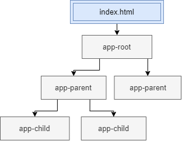

Eine Komponente steuert einen Teil des Bildschirms, den View.
Es besteht aus einer TypeScript-Klasse, einem HTML-Template und einem CSS-Stylesheet.
Die TypeScript-Klasse definiert das Zusammenspiel der HTML-Vorlage und der gerenderten DOM-Struktur,
während das Stylesheet ihr Aussehen beschreibt.


### Metadaten ###

Im Decorator @Component wird die Klasse um Metadaten erweitert.
Hier wird die Klasse als Angular-Komponente definiert und beschrieben.

````
import { Component } from '@angular/core';

@Component({
  selector: 'app-component-overview',
  templateUrl: './component-overview.component.html',
  styleUrls: ['./component-overview.component.css']
})

export class ComponentOverviewComponent {
  constructor() { }
}
````
* __selector:__ CSS-Selektor zum Einfügen einer Instanz dieser Komponente, an das HTML-Template
* __templateUrl:__ Pfad zur HTML-Vorlage für die Komponente
* __template:__ um direkten HTML Code zu beschreiben
* __styleUrls:__ Pfade zu einem oder zu mehreren CSS-Stylesheets
* __styles:__ um direktes CSS zu beschreiben


* __providers:__ Liste von Services, die mittels Dependency Injection bereitgestellt werden
* __directives:__ Liste von Direktiven welche die Komponente verwenden will


#### Selector ####

Die Komponente wird innerhalb des Selectors gerendert, der in den Metadaten angegeben wird.
Dabei kann der Selector ein eigener Tag sein, aber auch eine CSS-Klasse oder ein Attribut.

```
@Component({
  selector: 'app-root',
```
In dieser Variante ist der Selector ein eigenes HTML-Element. 
Das ist auch die geläufige Form eines Selectors.
```
  <body> 
    <app-root></app-root> 
  </body> 
```
Sobald Angular im Template den Selector findet, rendert er den View der Komponente
genau an die Stelle, an dem sich der Selector befindet.

```
// CSS Klasse                   | // Attribut                   | // Attribut mit Wert
                                |                               | 
@Component({                    | @Component({                  | @Component({ 
  selector: '.app-root'         |   selector: '[app-root]'      |   selector: 'div[app=components]' 
})                              | })                            | }) 
```

```
// CSS Klasse                   | // Attribut                   | // Attribut mit Wert
                                |                               |
<div class="app-root"></div>    | <div app-root></div>          | <div app="components"></div>
```


### Komponenten einer Component ###

Wird mit der CLI eine Komponente im Terminal erstellt, generiert Angular automatisch vier Dateien:
* __Ein HTML Template__, welche die Struktur der Seite definiert.
* __Eine TypeScript Klasse__, die das Verhalten der Seite beschreibt.
* __Eine CSS Datei__, welche für das Layout zuständig ist.
* __Ein Unit-Test__, mit dem die Anwendung getestet werden kann.


#### Template (View) ####

Das Template definiert das Layout und den Inhalt der Ansicht/View.
Ohne ein Template kann Angular nichts im DOM rendern.
Es besteht aus HTML Code mit einer spezifischen Angular Template Syntax.

```
<body>
  <app-root></app-root>
</body>
```
In den Templates können Angular-Komponenten, Angular-Direktiven und 
Angular-Pipes hinzugefügt werden. Die Daten zum Template kommen von ihrer
Komponente, die ihre Daten wiederum von einem Angular-Service erhält.
Mithilfe von _Data Binding_ werden die Informationen zwischen Template
und Komponente synchron gehalten.


#### Class (Logik) ####
Die Klasse der Komponente besteht aus einer TypeScript-Datei. 
Sie enthält Eigenschaften und Methoden, die per _Data Binding_ mit dem Template
verbunden werden. Sie kann die gesamte Logik der Komponente beinhalten,
es ist jedoch üblich, dass sie ihre Daten von einem Service bekommt.

```
export class MyComponent {
    title : string ="app"
}
```


#### Css (Style) ####
Eine Komponente kann ihre eigenen Styles haben, entweder als eine externe CSS-Datei,
oder _inline_. Die Styles werden in einem Array als einzelne Strings mit CSS Code angegeben.

```
@Component({
  selector: 'app-xy',
  template: `<h1>Tour of Heroes</h1>
             <app-xy></app-xy>`,
  styles: ['h1 { font-weight: normal; }']
})
```


#### Spec (Tests) ####
Angular erstellt eine Datei zum Testen der Komponente. Diese Datei muss die Endung
`spec.ts` haben, damit das Angular-Tool diese als Test-Datei erkennt. Zudem muss
die Test-Datei im gleichen Ordner liegen wie die zu testende Komponente.

Angular installiert das Framework <a href="https://jasmine.github.io/">_Jasmine_</a> 
für seine Tests. Der _"watch mode"_ wird im Terminal gestartet mit `ng test`
Der Browser wird geöffnet, indem das Ergebnis präsentiert wird. 

ERROR: _"No binary for Chrome browser on your platform"_
Dieser Fehler wurde mir unter Linux angezeigt. Entweder soll die _CHROME_BIN_ 
konfiguriert werden, oder in der _karma.conf.js_ wird der Browser geändert.
Da ich Firefox verwende, bot es sich an den Browser zu ändern:

```
npm install karma-firefox-launcher --save-dev
```

In der karma.conf.js Datei:
```
    plugins: [
      require('karma-jasmine'),
      require('karma-firefox-launcher'),
      require('karma-jasmine-html-reporter'),
      require('karma-coverage'),
      require('@angular-devkit/build-angular/plugins/karma')
    ],
    
    ...
    
    browsers: ['Firefox'],
```


### Einbinden einer Komponente ###

Komponenten sind in einer Baumstruktur angeordnet, beginnend von der _index.html_
und der _app-root_. Diese Komponente ist nicht anders wie alle anderen Komponenten.
Sie ist im NgModule als _Bootstrap_ Komponente eingetragen, somit ist es die 
erste Komponente die Angular ausführt.



Eine Komponente wird in ein Template eingebunden, so wird die _app-root_ Komponente
im `<body>` von _index.html_ eingetragen. Dafür wird der, in der Komponente definierter, Selector
benutzt.

```
@Component({
  selector: 'app-root'
})
```
```
<body>
  <app-root></app-root>
</body>
```

In der HTML-Datei der _app-root_ Komponente wird die Anwendung mit ihren weiteren
Komponenten geladen. 

__Mit einem Wert__  
HTML-Tags können Attribute haben, so auch die Komponente. Dieses Attribut dient dazu 
der Komponente Informationen mitzugeben. Der Name des Attributs ist der Name der
Eigenschaft, indem die Information gespeichert werden soll.
Da diese Information vom Elternteil kommt, muss das Kind den Wert mit _@Input()_ aufgreifen

```
<app-child [name]="'string'"></app-child>
```

__Dynamisches laden__  
Mit Direktiven ist ein dynamisches und bedingtes laden von Komponenten möglich. 
So kann zum Beispiel _ngFor_ mehrere Komponenten mit verschiedenen Übergabewerten
erstellen. 
```
<div *ngFor="let item of list">
  <app-child [entry]="item"> </app-child>
</div>
```

