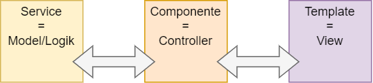
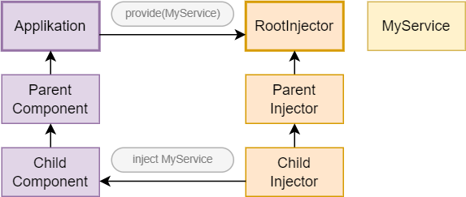
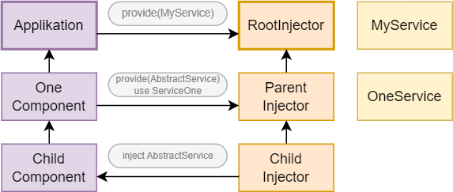
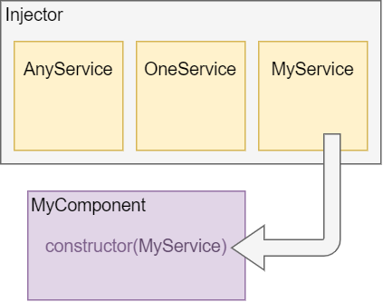

## Dependency Injection ##

Wenn man im Googleübersetzter "Dependency Injection" eingibt, 
kommt "Abhängigkeitsspritze" heraus!

Beim Erstellen eines Modules oder einer Klasse, kann es sein das diese Fähigkeiten einer anderen Klasse benötigt.
Zum Beispiel einen HTML Service um mit dem Backend zu kommunizieren. 
Dependency Injection ist ein Meschanismus, um der Anwendung zugriff auf benötigte andere Teile 
der Anwendung zu ermöglichen. Typischerweise sind diese Dependency Injections Services,
können aber auch Werte wie Strings oder Funktionen sein. 


### Aufgabe des Services ###

Angular unterscheidet zwischen Komponenten und Services.
Die Idee dahinter ist es Komponenten schlank und effizient zu halten,
indem sie nur View-Bezogene Funktionen beinhalten.
Idealerweise besteht ihre Aufgabe nur darin die Benutzererfahrung zu ermöglichen
und nichts weiter. Das macht sie, indem sie Eigenschaften und Methoden für die
Datenbindung bereitstellt und zwischen dem Template/View und der Anwendungslogik
(meist ein Model) vermittelt.



Ein Service ist in der Regel eine Klasse mit einer engen und klar definierten Aufgabe.
Das kann die Beschaffung von Daten aus einer API sein,
oder die Validierung von Benutzereingaben.
Es ist auch möglich das ein Service selbst einen Service nutzt.

- Ein Service kapselt die Applikationslogik
- Ein Service hält Informationen, die mehrere Komponenten benötigen

#### Lose und enge Kopplung ####

Um einen Service einzubinden, könnte dieser im Constructor injiziert und in einer
Membervariable gespeichert werden. Das macht es aber unmöglich die Komponente, ohne
den Service zu testen. Sie haben eine _enge_ Kopplung.  
Anstatt den Service innerhalb der Komponente zu instanziieren, wird er in Angular durch
eine übergeordnete Instanz erzeugt und der Komponente übergeben. 
Das wäre dann die _lose_ Kopplung. Nun ist es leicht den Service auszutauschen.


### Injector ###

Während des Bootstrap wird automatisch ein Injector (abstrakte Klasse) erstellt, 
der die benötigten Dependencies bereitstellt, sobald sie gebraucht werden. 
Es gibt zwei Rollen in diesem System zwischen denen der Injector vermittelt:

- Dependency consumer
- Dependency provider

Wird eine Dependency gebraucht, schaut der Injector, ob es bereits eine Instance gibt.
Wenn nicht, erstellt der Injector diese Instance und lagert sie in der _registry_.
Angular erstellt einen Injektor für die gesamte App ("root" injector) 
sowie benötigte lokale Injectoren. In den meisten Fällen muss dieser nicht manuell erstellt werden.

#### Hierarchische Injector-Baum ####

Es gibt in Angular nicht nur einen Injector, jede Komponente ha auch einen eigenen Injector.
Benötigt eine Komponente einen Service, fragt diese erst ihren eigenen Injector.
Wird ein passender Service nicht gefunden, geht die Frage den Injector-Baum hoch, bis
zum Root-Injector.

#### Globale Services ####



In diesem Bild befindet sich `MyService` im RootInjector. Um dort einen Service zu hinterlegen
wird er in NgModule unter providers aufgelistet. Alle Services hier sind _Singleton_, sie
haben in der gesamten Anwendung nur eine Instanz, auf der jede Komponente zugreifen kann.
Diese Services eignet sich hervorragend, um der ganzen Anwendung Daten zur verfügung zu stellen.

#### Komponenten-bezogene Services ####



Mansche Services gehören fachlich zu einer bestimmten Komponente. Der Injector-Baum
erlaubt auch in unterschiedlichen Szenarien verschiedene Services zu implementieren.
Wichtig ist dabei eine einheitliche Schnittstelle, durch eine abstrakte Klasse.
Die Bereitstellung des tatsächlichen Services findet weiter oben im Baum statt.

> __Abstrakte Basisklasse vs. Interface__  
> Interfaces in Typescript dienen nur der Typsicherheit zur Compiler-Zeit.
> Im generierten Code sind Interface-Definitionen komplet entfernt.
> Sie können also nicht als Schlüssel für Dependency Injection genutzt werden.

In der Komponente wird der Service wie folgt eingebunden:

```
@Component({
  selector: 'one-component',
  providers: [{provide: AbstractService, useClass: OneService}],
  ...
})
export class OneComponent { }
```
Alle Komponenten unterhalb OneComponent werden nun beim DJ von AbstractService den
OneService injizieren. So kann ein "TwoComponent" unter AbstractService einen anderen
Service einbinden.

#### Lookup ####

Wird im `@Inject`-Decorator nichts weiter Konfiguriert, wird erst im eigenen Injector
gesucht und dann den Baum hoch, bis zum Root. Wird auch dort nichts gefunden, wird ein
Fehler ausgelöst. Dieses Verhalten kann geändert werden.

- Einen Service mit `@Optional()` optional machen:
```
constructor(@Optional() cacheService: CacheService) { }
```

- Nur bis zum nächsten Host-Element mit `@Host()` suchen. Verhindert das ein globaler Service genutzt wird
```
constructor(@Host() myService: MyService) { }
```

- Mit `@SkipSelf()` kann der eigene Injector ausgelassen werden
```
constructor(@Optional() @SkipSelf() myService: MyService) { }
```

- Mit `@Self()` wird nur im eigenen Injector gesucht
```
constructor(@Optional() @Self() myService: MyService) { }
```


 
`@Self()` kan dazu genutzt werden das Verhalten einer Direktive nur dann
zu verändern, falls eine andere Direktive am Element vorhanden ist. Hat das Element
zum Beispiel einen Rand, der einmal dünn gezeichnet, einmal fett und rot gezeichnet werden soll
sähe das so aus:

```
Directive({
  selector: '[chAlert]'
})
export class AlertDirective {
  constructor(private el: ElementRef) {
    this.el.nativeElement.style.color = 'red';
    this.el.nativeElement.style['font-weight'] = 'BOLD';
  }
}
```
```
@Directive({
  selector: '[chBorder]'
})
export class BorderDirective {
  constructor(private el: ElementRef,
              @Self() @Optional() alert: AlertDirective) {
    const borderWidth = alert ? '3px' : '1px';
    this.el.nativeElement.style.border = 'solid '+ borderWidth;
  }
}
```
```
<div chAlert chBorder >Ich bin ein Alarm</div> <!-- Border-Breite 3px-->
<div chBorder>Ich bin eine normale Box</div> <!-- Border-Breite 1px -->
```


### Provider ###


Der Injektor verwaltet eine Liste von Providern. In dem Zusammenhang sind Provider
Regeln die beschreiben was passieren soll, wenn eine bestimmte Dependency benötigt wird.

### Regeln der Provider ###

Wenn eine Klasse als Dependency angegeben wird sieht es so aus: `providers: [myService]`  
Allerdings ist das eine Kurzschreibweise von: `[{provide: MyService, useClass: MyService}]`  
Diese erweiterte provider Konfiguration ist ein Objektliteral mit zwei Eigenschaften.
- Token, ein Schlüssel welcher der Injector nutzt.
   - token: Die Klasse selbst
   - token: String
   - token: InjectionToken
- Formel zur Erzeugung des Dependencies.
   - `useClass` Angular soll die bereitgestellte Klasse verwenden
   - `useExisting` Ein Token, der auf eine vorhandenes Dependency verweist
   - `useFactory` Return Wert einer Funktion welche die Dependency erstellt
   - `useValue` Ein statistischer Wert als Dependency


#### Token ####

Der Injektor hat ein Array, indem er die Token als Key verwendet um die
Provider lokalisieren zu können. Diese _DI Token_ können drei Arten von Typen haben:
Ihre eigene Klasse, ein String oder eine Instanz von InjectionToken.

Die eigene Klasse:
```
providers: [{ provide: MyService, useClass: MyService }]
```
```
class MyClass {
   constructor(private service : MyService)
}
```


Ein String wird benutzt, wenn der Dependency ein Wert und keine Klasse ist.
Mit der Methode _@Inject()_ kann dieser Dependency injiziert werden.
```
providers: [{ provide: 'MY_STRING', useValue: 'Hello World' }]
```
```
class MyClass {
   constructor( @Inject('MY_STRING')private hello : string)
}
```


Das Problem bei Strings ist, dass der gleiche Token String in einem anderen Teil
der Anwendung benutzt werden könnte. Der neuere Token würde den vorherigen überschreiben.
Um das zu verhindern, gibt es zusätzlich die InjectionToken

```
export const MY_STRING = new InjectionToken<string>('');
```
```
providers: [{ provide: MY_STRING, useValue: 'Hello World' }]
```
```
class MyClass {
   constructor( @Inject(MY_STRING)private hello : string)
}
```


#### useClass ####
Diese Definition sagt aus, dass die Dependency aus einer Klasse besteht.
Token und Definition haben die gleiche Bezeichnung, weswegen meist _useClass_
weg gelassen wird
```
providers: [{ provide: MyService, useClass: MyService }]    // Lange Form mit useClass
                                                            //
providers: [ MyService ]                                    // Shortcut der Langform
```

Ein Grund dennoch die lange Schreibweise zu wählen ist das Austauschen der
Dependency, zum Beispiel wenn getestet wird.
```
providers: [{ provide: MyService, useClass: FakeMyService }]
```


#### useExisting ####

Soll ein Provider anstelle eines anderen Providers benutzt werden, wird _useExisting_ angegeben.
Es gibt den Token an und nicht den Typ.

```
providers: [
  { provide: ProductService, useExisting: NewProductService },
  { provide: NewProductService, useClass: NewProductService },
```
In diesem Beispiel wird immer `NewProductService` zurückgegeben wenn `ProductService` verwendet wird.
In dem anderen Beispiel ist der Token der String `MY_PRODUCT` welcher _useExisting_ benutzt.
```
providers: [
  { provide: ProductService, useExisting: 'MY_PRODUCT' },
  { provide: 'MY_PRODUCT', useClass: NewProductService },
```


#### useFactory ####
Mit dieser Definition ist es möglich, basierend auf eine bestimmte Bedingung,
ein Objekt zurückzugeben. So können unterschiedliche Services geladen werden.
Dieser _Fabrikfunktion_ können mit dem `deps` Array Argumente übergeben werden.

```
providers: [{ 
      provide: MyService, 
      useFactory: (xy)=> xy ? new AnyService() : new MyService(), 
      deps: [xy] 
   }]
```
(Die Funktion muss keine Pfeilfunktion sein, es kann auch eine exportierte Funktion benutzt werden)

Das Array `deps` ist das dritte Argument von _providers_.
Wenn eine der möglichen Funktionen eine weitere Abhängigkeit braucht, kann es mit `deps` übergeben werden.

__Zum Beispiel,__   
könnte ein Login-Service für Gäste oder registrierte User geladen werden.
Ob der Besucher Gast, oder User ist, wird in einem _useValue_ gespeichert.
Ist der Besucher ein User, braucht der Login-Service zusätzlich einen User-Service.

```
{ provide: LoginService, useClass: LoginService },
 
{ provide: 'USER', useValue: true },
```

Damit die Funktion diese beiden Werte bekommt, werden sie in das `deps` Array gesteckt,
und als Argumente übergeben. Dadurch weiß der Injector wie die Abhängigkeiten in der Funktion
injiziert werden sollen. Deswegen muss die Reihenfolge im Array mit den Argumenten der Funktion
übereinstimmen. Abhängig davon welchen Wert `USER` hat,
wird entweder `GuestService` oder `UserService` zurück gegeben.

```{ 
{ 
  provide: UserService, 
  useFactory: (USER, LoginService)=> 
               USER ? new GuestService() : new UserService(LoginService), 
  deps: ['USER', LoginService] 
}
```

Soll eine exportierte Funktion benutzt werden, würde sie so geschrieben werden:

```
export function resolveUserService(USER, LoginService){
   return USER
      ? new GuestService()
      : new UserService(LoginService)
}

```
```
  useFactory: resolveUserService,
  deps: ['USER', LoginService]
```


#### useValue ####
Eine Dependency kann auch ein einfacher Wert sein, inder zum Beispiel ein String einer
URL oder einer API gespeichert ist, ein Boolean, ein Objekt oder eine Funktion.
Diese Dependency wird mit einem String Token eingebunden und mit der Methode _@Inject()_ injiziert.


```
const APP_CONFIG =  Object.freeze({
  emailURL: 'www.email.com',
  IsDevleomentMode: true
});
```
```
providers: [{ provide: 'APP_CONFIG', useValue: APP_CONFIG }]
```
```
class MyClass {
   constructor( @Inject('APP_CONFIG')private appConfig : any)
}
```


#### useValue vs useFactory ####

Während _useValue_ die gesamte Funktion zurückgibt, wird bei _useFactory_ der Wert zurückgegeben.

```
// useValue                                  | // useFactory
                                             | 
providers: [                                 | providers: [   
  {                                          |   {
    provide: 'FUNC',                         |     provide: 'FUNC',    
    useValue: () => {                        |     useFactory: () => {   
      return 'hello';                        |       return 'hello'; 
    }                                        |     }   
  }                                          |   }  
]                                            | ]  
```

```
// useValue                                  | // useFactory
                                             | 
export class MyComponent {                   | export class MyComponent { 
  constructor(                               |   constructor(  
    @Inject('FUNC') public someFunc: any     |     @Inject('FUNC') public someFunc: any 
  ) {                                        |   ) { 
    console.log(someFunc());                 |     console.log(someFunc); 
  }                                          |   }  
}                                            | }  
```


### Dependency bereit stellten ###

Mit dem Decorator _@Injectable_ wird eine Klasse zu einer Dependency Komponente

```
@Injectable
class MyService {}
```
Es gibt nun verschiedene Möglichkeiten diesen Service bereit zustellen. 
In der Komponente die den Service benutzt, 
in einem ngModule wo dann alle Mitglieder des Modules auf dem Service zugreifen können,
oder für die gesamte Anwendung, in dem der Service die Option `providedIn: 'root'` erhält.

```
// In der Komponente            | // Im ngModule                    | // Im Service selbst
                                |                                   | 
@Component ({                   | @ngModule ({                      | @Injectable ({
    selector: 'xy',             |     declarations: [MyClass]       |     providedIn: 'root'
    template: 'xy',             |     providers: [MyService]        | })
    providers: [MyService]      | })                                | 
})                              |                                   | 
class MyClass { }               | class MyModule { }                | class MyService { }
```

#### Treeshakable-Providers ####  
Um die Anwendung möglichst klein zu halten, entfernt Tree-shakable nicht benötigten Code.
Der DOM wird dafür schrittweise aufgebaut und lässt die Komponenten weg, auf die es keine Verweise gibt.

Wird eine Dependency im NgModule eingebunden, wird diese geladen, selbst wenn niemand sie braucht.
Hat die Dependency in ihrem Decorator `providedIn: 'root'` stehen, so wird sie nur injiziert, wenn eine Komponente sie braucht.
In `ngModule` braucht sie nicht mehr importiert zu werden. Das ist besonders praktisch, wenn es um große Bibliotheken handelt.


### Dependency injizieren ###



Wenn Angular eine neue Instanz erstellt, Komponente, Direktive oder Pipe,
die einen Dependency hat, schaut es auf die Parameter des Constructors.
Zuerst checkt Angular, ob der Service bereits eine Instanz im Injector hat.
Wenn nicht, wird eine Instanz im Injector registriert bevor Angular den Service zurückgibt.

```
@Component ({...})
class MyClass {
    constructor(@Inject(MyService) service: MyService) { }
}
```

Da die Komponente und der Service einen Decorator besitzen (@Component und @Inject),
kann im Constructor das `@Inject` weggelassen werden. Die verkürzte Schreibweise
sähe dann so aus:  
```
    constructor(service: MyService) { }
```
Das funktioniert nicht, wenn der Service selbst einen Service benutzt. Typescript
würde beim Compilieren zu Javascript seine Typen verlieren.
Die stehen in den Metadaten des Decorators, die der Injektor zum Injizieren braucht.

#### Member-Injection ####

Der Service kann in eine Membervariable gespeichert werden. Üblicherweise wird
die Zuweisung einer Membervariable innerhalb des Constructors gemacht.

```
private myService: MyService;

constructor(myService: MyService) {
  this.myService = myService;
}
```

Auch hier gibt es eine verkürzte Schreibweise:

```
constructor(private myService: MyService) { }
```


### Sichtbarkeit von Provider beschränken ###

Eine Komponente reicht seine Dependencies an all seine Kind-Komponenten weiter.
Das ist aber nicht immer so gewünscht, nicht jedes Kind braucht diese oder jene
Dependency. 
Um diese Bindung einzuschränken, gibt es außer der `providers`-Eigenschaft die
`viewProviders`-Eigenschaft.

> Es gibt verschiedene Arten von Kindern:  
> - Einmal als eingebundene Komponente <one-component></one-component>  
> - Und einmal als Direktive <ng-content></ng-content>  

Angenommen ein Service soll einmal global, einmal nur in einer Komponente
verwendet werden, kann es leicht zu Fehlern kommen, wenn in der Komponente
der Service nicht richtig eingebunden wird.
In dem Fall gilt auch für das Kind der globale Service, eine unkontrollierte Vererbung. 
Abhilfe schafft in dem Fall `viewProviders`:

```
@Component({
  selector : 'app-component',
  viewProviders: [{provide: AbstractService,
                   useClass: GlobalOneService}]
})
```
Jetzt ist der Service nur noch innerhalb seiner Komponente zu erreichen,
nicht mehr aber für die Kinder. Sollten sie versuchen auf den Service zuzugreifen
gäbe es eine Exception.
Das kann genauso auch für Routing verwendet werden.