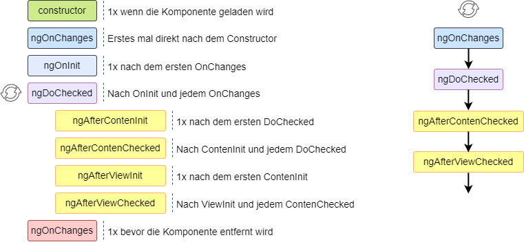

## Lifecycle ##

Eine Komponenteninstanz hat einen Lebenszyklus, der beginnt,
wenn Angular die Komponentenklasse instanziiert und die Komponentenansicht zusammen
mit ihren untergeordneten Ansichten rendert.

Angular erkennt danach, wenn sich datengebundene Eigenschaften ändern und
aktualisiert bei Bedarf die Ansicht oder Instanz. 
Der Lebenszyklus endet, wenn die Komponenteninstanz zerstört und die gerenderte Vorlage
aus dem DOM entfernt wurde.  

<br>


### Constructor ###
Der Constructor ist für die erstmalige Instanziierung der Komponente zuständig.
Zu diesem Zeitpunkt gibt es weder die Views noch datengebundene Daten,
daher sollte möglichst wenig Logik im Constructor stecken.

In Angular hat der Constructor eine andere wichtige Aufgabe, 
mit ihm werden Dependency Injection (Abhängigkeiten) zur Verfügung gestellt.
Diese werden als Argumente übergeben.


### Lifecycle Events ###

Es gibt Methoden, die es ermöglichen zu bestimmten Ereignissen im Lebenszyklus einzugreifen.
Diese Methoden werden Hooks genannt. Um sie nutzen zu können gibt es verschiedene Inferfaces.
Es müssen nicht alle, sondern nur die benötigten Hooks implementiert werden.

Nach dem Aufruf des Konstruktors werden diese Hooks in dieser Reihenfolge aufgerufen.

| Interface           | Hook                  | Beschreibung                          |
|---------------------|-----------------------|---------------------------------------|
| OnChanges           | ngOnChanges           | Änderung von Eingabewerten (@Input)   |
| OnInit              | ngOnInit              | Nach dem Aufbau der Data-Bindings     |
| DoCheck             | ngDoCheck             | Eigene Change Detection               |
| AfterContentInit    | ngAfterContentInit    | Nach dem Projizieren des Contents     |
| AfterContentChecked | ngAfterContentChecked | Kontrolle auf Änderungen des Content  |
| AfterViewInit       | ngAfterViewInit       | Nach dem initialisieren der Views     |
| AfterViewChecked    | ngAfterViewChecked    | Kontrolle auf Änderungen in den Views |
| OnDestroy           | ngOnDestroy           | vor dem Entfernen der Komponente      |


### OnChanges ###  
Diese Methode wird aufgerufen, wenn datengebundene Eigenschaften gesetzt oder verändert werden.
Sie empfängt ein SimpleChanges Objekt mit den aktuellen und vorherigen Werten.
Da diese Methode häufig aufgerufen wird, kann sich das erheblich auf die Leistung auswirken.
Wenn es keine Eingaben gibt, oder keine Eingaben verwendet werden, wird OnChanges nicht aufgerufen.

```
export class ChildComponent implements OnInit, OnChanges {
  constructor() { }

  @Input() text? : string;

  ngOnInit(): void {
  }

  ngOnChanges(changes: SimpleChanges): void {
    console.log('Previous Text: ', changes['text'].previousValue);
    console.log('New Value: ', changes['text'].currentValue);
  }
}
```
In dieser Komponente wird der Text aus einem Input-Feld in der _text_ Variable gespeichert
und bei jeder Änderung des Input-Feldes aktualisiert. Der erste Aufruf, vor dem OnInit
gibt noch ein _undefined_ aus.
```
<!-- Erster Aufruf -->          | <!-- Zweiter Aufruf -->
                                | 
Previous Text:  undefined       | Previous Text:  Hallo 
New Value:  Hallo               | New Value:  Hallo!
```
Die Eltern-Komponente besitzt die Eigenschaft _string_ welche sich durch `[(ngModel)]` 
im Input-Feld aktualisiert. Diese Information wird mit `[text]="string"` an die
Kind-Komponente weiter gereicht, an `@Input() text`
```
<app-child [text]="string"></app-child>
<input type="text" [(ngModel)]="string" />
```


### OnInit ###  
Nachdem ersten OnChanges, also wenn datengebundene Eigenschaften gesetzt sind,
wird einmalig OnInit aufgerufen. Es wird auch dann aufgerufen, wenn es kein OnChange gibt.
Mit ihm können komplexere Initialisierung außerhalb des Konstruktors ausgeführt werden,
oder die Komponente einrichten, nachdem Eingabeeigenschaften festgelegt wurden.

```
export class ChildComponent implements OnInit {

@Input() text?: string;

  ngOnInit() {
    console.log(this.text)
  }
}
```
Dieser Hook bietet sich an Daten aus dem Backend zu laden oder die @Input() Werte mit
Default Werten zu belegen.


### DoCheck ###  
Mit diesem Hook kann auf eine Änderung reagiert werden, die Angular selbst nicht erkennt,
oder erkennen will. Er ist daher ein sehr teurer Hook, da er auch dann ausgeführt wird,
wenn sich nichts geändert hat. Beispielsweise ein Vergleich zweier Inputfelder,
jedes mal wenn der Focus auf eines der Felder wechselt.  
Der Hook kann nützlich sein, wenn sich Daten innerhalb eines gebundenen Objektes ändern.
Er wird zusätzlich nach jedem OnChange und unmittelbar nach dem ersten OnInit aufgerufen.

```
export class AppComponent {
  greeting = {
    text: ''
  };

  textChanged(text: string) {
    this.greeting.text = text;
  }
}
```
_greeting_ ist ein Objekt mit der Eigenschaft _text_. Im Template kann der Wert von 
_text_ geändert werden. Das Objekt bleibt jedoch das gleiche, sodass _OnChange_ 
der Kind-Komponente nicht ausgelöst wird.

Soll jetzt aber doch darauf regiert werden muss in der DoCheck Methode manuell
überprüft werden ob sich der Wert geändert hat.

```
export class ViewChildComponent implements DoCheck {
  @Input() public greeting?: Greeting;
  private previousGreetingText?: string;

  ngDoCheck() {
    if (this.greeting && this.greeting.text !== this.previousGreetingText) {
      this.previousGreetingText = this.greeting.text;
      
      console.log('New greeting text: ', this.greeting.text);
    }
  }
}
```


### AfterContentInit / AfterContentChecked ###  
Dieser Hook wird einmal nach dem ersten DoCheck aufgerufen. 
Mit ihm können Komponenten in Komponente verschachtelt werden.
Dies ist eine dynamische Komponenten-Hierachie.
Die _app-child_ Komponente benutzt das AfterContent-Interface und bindet die Methoden ein.

```
<app-child [text]="string" >
  <app-content-child></app-content-child>
</app-child>
```

```
export class ChildComponent implements AfterContentInit{
  constructor() { }

  @Input() text? : string;
  @ContentChild(ContentChildComponent) contentChild?: ContentChildComponent;

  ngAfterContentInit() {
    console.log(this.contentChild);
  }
}  
```

Mit AfterContentChecked kann auf Veränderungen, des externen Contents reagieren werden. 
Es wird auch mit jedem nachfolgendem DoCheck aufgerufen. 


### AfterViewInit / AfterViewChecked ###  
AfterView verhält sich ähnlich wie AfterContent, bezieht sich aber auf "bekannte" Views.
Die Child Views werden im Template ihrer Eltern initialisiert, sind alle geladen reagiert
der AfterViewInit-Hook
```
<p>
  <app-view-child></app-view-child>
</p>
```
```
export class AppComponent implements AfterViewInit{

  @ViewChild(ViewChildComponent) viewChild?: ViewChildComponent;

  ngAfterViewInit() {
    console.log(this.viewChild);
  }
}
```

Da Angular die Ansichtshierarchie während der Änderungserkennung durchläuft, 
muss sichergestellt werden, dass eine Änderung in einem child view nicht versucht,
Änderung auf dem parent view zu verursachen. 
Der Datenfluss läuft nur in eine Richtung, so können solche Änderungen nicht richtig dargestellt werden.  
AfterViewInit wird einmal nach AfterContentChecked aufgerufen, 
danach startet AfterViewChecked und nach jedem weiteren AfterContentChecked


### OnDestroy ###  
Kurz bevor Angular die Komponente zerstört und aus dem DOM entfernt wird OnDestroy aufgerufen.
Hier können Ressourcen freigeben werden, die nicht automatisch von der Garbage Collection erfasst wurden.
Das Betrifft Observer, Event-Handler, auch Intervall-Timer oder andere Callbacks von Services.
Mit OnDestroy kann ein anderer Teil der Anwendung informiert werden, dass die Komponente entfernt wird. 


