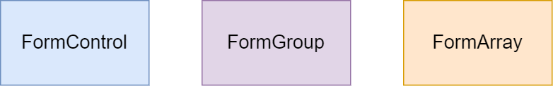
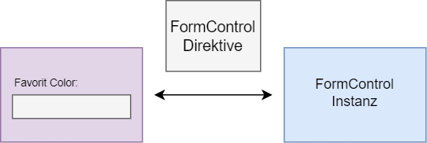
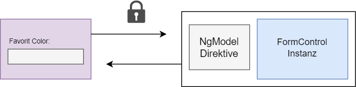
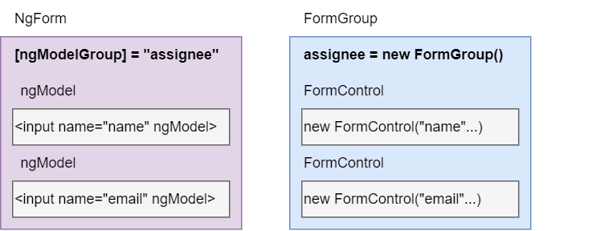

## Formulare ##

Für Formulare gibt es einige Direktiven, die mit dem `FormsModule` geliefert werden.
Mithilfe des Modules können Benutzereingaben erfasst, verfolgt, verändert oder validiert werden.
Dabei gibt es zwei Arten von Formularen.

- __Template-Driven Forms__ (Die Logik des Formulas ist im Template)
- __Reactive Forms__ (Die Logik liegt als Objekt in der Komponente)

### Bausteine des FormsModule ###
Beide Arten von Formularen bestehen aus drei Bausteinen.



.


### FormControl ###
FormControl repräsentiert ein einzelnes Input-Feld.
Es ist ein Objekt, indem alle Informationen des Feldes gekapselt sind.
Das ist zum Beispiel der Wert des Feldes, ob es gültig ist, oder ob es geändert wurde.

```
//simple Text input box                   | // input with FormControl
                                          | 
<input type="text" name="firstname">      | <input type="text" [formControl]="firstname"> 
```

Ein FormControl wird mit `new FormControl()` erstellt. Als Parameter kann der Value
des Inputfeldes gesetzt, oder der Status bestimmt werden. 

```
let firstname = new FormControl();

let control = new FormControl("Hallo!");                        // control.value = 'Hallo'

let control = new FormControl({value: "n/a", disabled: true});  // control.status = 'DISABLED'

let control = new FormControl("", Validators.required);         // control.status = 'INVALID'

let control = new FormControl('Nancy', {nonNullable: true});    // Wird es reset() bekommt es seinen Anfangswert zurück
```

#### Methoden vom FormControl ####

- this.firstname.__setValue("Neuer Wert")__  
  (Es gibt auch `patchValue()`, was das gleiche macht. Das ist nur aus Symmetriegründen drin)


- this.firstname.__reset()__     
- this.firstname.__reset("Hallo")__     
- this.firstname.__reset({ value: "Hallo", disabled: true })__  
  (Setzt das Feld zurück und gibt ihm den Status `pristine` und `untouched`)


- this.firstname.__getRawValue()__  
  (Gibt den Value des Feldes zurück, z.B "Neuer Wert")


- this.firstname.__registerOnChange(fn: Funktion)__  
  (Ruft eine Funktion auf, wenn der Value sich ändert (nicht Zeitgleich) z.B. nach `setValue()`)


### FormGroup ###
Die FormGroup ist eine Sammlung an FormControl-Objekten. Jedes Objekt ist eine
Eigenschaft von FormGroup. Ein Formular besteht aus mehreren Feldern. Um alle Felder zu prüfen,
bietet FormGroup ein interface, um nicht jedes Feld einzeln prüfen zu müssen.
FormGroups können auch ineinander verschachtelt sein.

```
let address = new FormGroup({
    street : new FormControl(""),
    city : new FormControl(""),
})
```

```
<form [formGroup]="adresse" (ngSubmit)="onFormSubmit()">
  Straße: <input type="text" formControlName="street"><br>
  Stadt: <input type="text" formControlName="city">
</form>
```


#### Methoden vom FormControl ####

- this.address.__setControl('street', new FormControl('Name'))__;  
  (Ersetzt das `FormControl`, der Key muss bereits existieren)


- this.adresse.__contains('name')__;  
  (Gibt true zurück, wenn ein FormControl mit dem namen existiert, sonst false)


- this.adresse.__setValue({street: "Weg", city: 'Dorf'})__;  
  (Setzt alle Values, wenn nicht alle angesprochen werden, gibt es einen Error)


- this.adresse.__patchValue({street: "Feldweg"})__;  
  (Setzt den Wert eines Values)


- this.adresse.__reset()__;  
  (Setzt alle Felder zurück und gibt ihm den Status `pristine` und `untouched`)


- this.adresse.__getRawValue()__;  
  (Gibt ein Objekt zurück mit den Keys und den Values der Control-Felder)

Es gibt auch _addControl('name', control)_ und _removeControl('name', control)_,
beide haben bei mir nicht funktioniert.


### FormArray ###
FormArray ist ähnlich wie FormGroup, es hält mehrere FormControl-Objekte.
Die Objekte sind hier keine Eigenschaften, sondern Array-Einträge.

```
contactForm = new FormGroup( {
    name: new FormControl(''),
    cities:new FormArray([
      new FormControl('Mumbai'),
      new FormControl('Delhi')
    ])
  });
```
```
 cities() :FormArray {
    return this.contactForm.get("cities") as FormArray
  }
```


### Reactive oder Template? ###

Template-driven Formulare werden wie der Name es schon sagt im Template beschrieben, 
samt ihrer Logik. Es sind einfache Formulare. Reactive Formulare greifen direkt
auf das Model zu, sind robuster und skalierbar. Sie lassen sich wiederverwerten und testen.

|             | Reactive                          | Template                       |
|-------------|-----------------------------------|--------------------------------|
| Einrichten  | Explizit, durch Komponentenklasse | Implizit, durch Direktiven     |
| Datenmodel  | Strukturiert und unveränderlich   | Unstrukturiert und veränderbar |
| Datenfluss  | Synchron                          | Asynchron                      |
| Validierung | Durch Funktionen                  | Durch Direktiven               |


### Reactive Forms ###
Das Formularmodel wird direkt in der Komponentenklasse definiert.
Dafür wird die Direktive _formControl_ im Template genutzt und eine 
Instanz _FormControl_ in der Komponente. 

```
@Component({
  selector: 'app-reactive-favorite-color',
  template: `
    Favorite Color: <input type="text" name="color" [formControl]="favoriteColorControl">
  `
})
export class FavoriteColorComponent {
  favoriteColorControl = new FormControl('');
}
```



### Reactive-Formular Validierung ###

Blabla


### Template-Driven Forms ###
Die Direktive NgModel erstellt und verwaltet eine _FormControl_ Instanz für ein bestimmtes Formularelement.
Es gibt keinen direkten Zugriff auf die FormControl Instanz.

```
@Component({
  selector: 'app-template-favorite-color',
  template: `
    Favorite Color: <input type="text" name="color" [(ngModel)]="favoriteColor">
  `
})
export class FavoriteColorComponent {
  favoriteColor = '';
}
```



#### Verschachtelte Formulare mit ngModelGroup ####
Um mit mehreren Elementen zu arbeiten, gibt es die Direktive _ngModelGroup_
Es kapselt alle Werte der Gruppe in ein Objekt (In dem Beispiel das assignee-Objekt)
Dieses Objekt hat die Eigenschaften der Namen der Elemente, zusammen mit dessen Werten.  
`{name:"", email:"", ...}`
```
<div ngModelGroup="assignee" *ngIf="task.assignee">
  <div>
    <label>Name</label>
    <input type="text" name="name" 
       [(ngModel)]="task.assignee.name"/>
  </div>
  <div>
    <label>E-Mail</label>
    <input type="text" name="email" 
       [(ngModel)]="task.assignee.email"/>
  </div>
</div>
```



### Template-Formular Validierung ###

Angular bringt standardmäßig ein paar Validierungs-Regeln mit

| Validierung        | Regel                                   | Rückgabe bei Fehler |
|--------------------|-----------------------------------------|---------------------|
| _required_         | Darf nicht undefiniert oder null sein   | true                |
| _minlength="5"_    | Muss mindestens 5 Zeichen lang sein     | {soll/ist}          |
| _maxlength="100"_  | Darf maximal 100 Zeichen lang sein      | {soll/ist}          |
| _min="3"_          | Muss mindestens Zahlwert 3 haben        | {soll/ist}          |
| _max="100"_        | Darf höchstens Zahlenwert 100 haben     | {soll/ist}          |
| _email_            | Muss eine gültige E-Mail Adresse sein   | true                |
| _pattern="[A-Z]+"_ | Muss dem regulären Ausdruck endsprechen | {soll/ist}          |

```
<input type="text" name="title"
    [(ngModel)]="task.title"
    required minlength="5" maxlength="100"/>
    
// Muss mindestens 5 Zeichen, aber höchstens 100 Zeichen haben    
```

```
firstname.errors      // returns the list of errors
firstname.dirty       // true if the value has changed (dirty)
firstname.touched     // true if input field is touched
firstname.valid       // true if the input value has passed all the validation
```


#### Mit CSS den Status darstellen ####

Zudem hat Angular zu Darstellung des Statuses ein paar CSS-Klassen dabei.

| Status                                    | Wenn true  | Wenn false   |
|-------------------------------------------|------------|--------------|
| Eingabefeld hatte/keine Fokus             | ng-touched | ng-untouched |
| Eingabefeld hatte/keine Eingaben erhalten | ng-dirty   | ng-pristine  |
| Keine/Hat Validierungsfehler gefunden     | ng-valid   | ng-invalid   |

Damit kann zum Beispiel ein Text angezeigt werden, welcher erscheint, wenn ein Fehler aufgetreten ist
```
<input type="text" class="form-control" name="title" 
    required
    [(ngModel)]="task.title" #title="ngModel" />
   
<div *ngIf="title.invalid && (title.dirty ||title.touched)" 
     class="alert alert-danger">
     Bitte geben Sie einen Titel an
</div>
```

Für die unterschiedlichen Errors können auch unterschiedliche Texte angezeigt werden
```
<div *ngIf="title.invalid && (title.dirty ||title.touched)" 
     class="alert alert-danger">
     
  <div *ngIf="name.errors?.['required']">
    Name is required.
  </div>
  
  <div *ngIf="name.errors?.['minlength']">
    Name must be at least 4 characters long.
  </div>
  
</div>
```


Durch die lokale Variable `#title="ngModel"` kann auf die Eigenschaften von _ngModel_ zugegriffen werden.
Darunter die Methoden _hasError_ und _getError_

```
<div *ngIf="title.hasError('minlength')">
   Der Titel muss mindestens
     {{ title.getError('minlength').requiredLength }}
   Zeichen enthalten
</div>

<div *ngIf="title.hasError('maxlength')">
   Der Titel darf maximal
     {{ title.getError('maxlength').requiredLength }}
   Zeichen enthalten
</div>
```

#### Formular mit ngSubmit versenden ####
In diesem Formular gibt es drei Input-Felder, die je das Attribut `name` haben müssen.  
Werden sie dann mit ngSubmit an die Funktion verschickt, können sie mit dem
Namen vom NgForm Objekt abgerufen werden. 
Der Submit-Button lässt sich erst dann drücken, wenn das gesamte Formular
valide ist (in diesem Beispiel sind keine Validatoren eingebaut, im Original schon)
```
<form (ngSubmit)="onSubmit(dataForm)" #dataForm="ngForm">

  Name <input type="text"
              [(ngModel)]="dataName" name="dataName"><br>
  Typ <input type="text"
              [(ngModel)]="dataType" name="dataTyp"><br>
  Wert <input type="text"
              [(ngModel)]="dataValue" name="dataValue"><br>

<button type="submit" [disabled]="!dataForm.form.valid">Senden</button>
</form>
```
```
  onSubmit(data: NgForm){
    console.log(data.value.dataName);
    console.log(data.value.dataTyp);
    console.log(data.value.dataValue);
  }
```


### Eigene Errormessages definieren ###
Dafür wird eine Eigene Komponente erstellt, welche sich um die Fehlermeldungen kümmert.
Ein Error ist eine boolische Eigenschaft des Formulars. Um die passende Message zu rendern
wird nach dem Key (Art des Fehlers) und dem Wert (Fehler, ja oder nein) geschaut.

Als Input wird der Name des zu prüfenden Formularfeldes gebraucht und das Formular an sich.

```
  @Input('name') controlName = "";
  @Input('form') form!: FormGroup;
```

Zuerst wird in einer Variable das Objekt für das zu prüfende Formularfeld gespeichert. 
Dann wird geschaut ob es im Formularfeld-Objekt invalide Eigenschaften gibt.
Wenn nicht, dann passiert nichts. Wenn doch wird eine Funktion mit den gefundenen Fehlern gefüttert.
In diesem Beispiel wird `getDisplayMessages(control.errors)` ausgeführt. 

```
  get errorMessages(): string[] | null {
    const control: AbstractControl | null = this.form.get(this.controlName);

    if (!control || !(control.touched) || !(control.errors)) {
      return null;
    }
      return this.getDisplayMessages(control.errors);
  }  
```

In dieser Funktion wird per switch zu jedem Fehler die passende Message definiert und ausgegeben.
Dafür wird über jede Fehlereigenschaft mit `.map` eine Pfeilfunktion ausgeführt, indem sich der switch befindet.
Benötigt wird nur der Key `([errorCode, error]) => { switch(errorCode) }`

```
  getDisplayMessages(errors: ValidationErrors): string[] {
    return Object.entries(errors).map(([errorCode, error]) => {
      
      switch (errorCode) {
        case 'required': {
          return 'Dieses Feld ist ein Pflichtfeld';
        }
        // und so weiter ...
        default: {
          return '';
        }
      }

    });
  }
```
Das dazugehörige Template der Fehlermeldung ist sehr simpel:

```
<div class="error" *ngIf="errorMessages">
  <div *ngFor="let message of errorMessages">
    {{message}}
  </div>
</div>
```


### Eigene Validierungsregeln definieren ###
#### Eigener Validator für reactive forms ####
In diesem Beispiel für ein reaktives Formular, wird ein RegExp mit einem Formular Value verglichen, wenn sie übereinstimmen wird ein Error mit dem Namen "forbiddenName" zurück gegeben. Bei asynchronen Validatoren ist es ähnlich, nur wird da diese Info als Observable zurück gegeben.

```
export function forbiddenNameValidator(nameRe: RegExp): ValidatorFn {
  
  return (control: AbstractControl): ValidationErrors | null => {
    const forbidden = nameRe.test(control.value);
    return forbidden ? {forbiddenName: {value: control.value}} : null;
  };
}
```

Validatoren für reaktive Formulare sind direkt im `FormControl`

```
this.heroForm = new FormGroup({

  name: new FormControl(this.hero.name, [
    Validators.required,
    Validators.minLength(4),
    forbiddenNameValidator(/bob/i) // <-- Here's how you pass in the custom validator.
  ]),

});
```


#### Eigener Validator für template forms ####

Diese Funktion muss für template Formulare in eine Direktive gepackt werden (Wrapper)
Diese Direktive registriert sich bei `NG_VALIDATORS` so weiß Angular das es sich um einen Validator handelt. Zusätzlich benutzt die Direktive das `Validator` Interface.

```
@Directive({
  selector: '[appForbiddenName]',
  providers: [
      {
        provide: NG_VALIDATORS, 
        useExisting: ForbiddenValidatorDirective, 
        multi: true
      }
    ]
})

export class ForbiddenValidatorDirective implements Validator {
  @Input('appForbiddenName') forbiddenName = '';

  validate(control: AbstractControl): ValidationErrors | null {
    return this.forbiddenName 
      ? forbiddenNameValidator(new RegExp(this.forbiddenName, 'i'))(control) 
      : null;
  }
}
```
Mit dem Selektor der Direktive kann der Validator nun im Tag des Templates benutzt werden.

```
<input type="text" id="name" name="name" class="form-control"
      required minlength="4" 
      appForbiddenName="bob"
      [(ngModel)]="hero.name" #name="ngModel">
```


### Asynchrone Validatoren ###

Ähnlich zu synchronen eigenen Validatoren implementiert der asynchrone Validator das `AsyncValidatorFn` und `AsyncValidator` Interface. Kleine Unterschiede gibt es dann doch:
 - Die `validate()` Funktion muss ein Promise oder Observable zurück geben
 - Das Observable muss beendet werden, z.B mit `first`, `last`, `take` oder `takeUntil`

Die asynchrone Validierung erfolgt nach der synchronen Validierung und wird nur durchgeführt, wenn die synchrone Validierung erfolgreich ist. Durch diese Prüfung können Formulare potenziell teure asynchrone Validierungsprozesse (z. B. eine HTTP-Anfrage) vermeiden, wenn die einfacheren Validierungsmethoden bereits ungültige Eingaben gefunden haben. 

Nachdem die asynchrone Validierung begonnen hat, wechselt das Form-Control in den Status „Ausstehend“ (pending).

Ein häufiges UI-Muster besteht darin, einen Drehknopf anzuzeigen, während die asynchrone Validierung durchgeführt wird. Das folgende Beispiel zeigt, wie dies in einem template Formular erreicht wird.

```
<input [(ngModel)]="name" #model="ngModel" appSomeAsyncValidator>

<app-spinner *ngIf="model.pending"></app-spinner>
```


#### Eigener asynchroner Validator ####

Sich immer wieder verändernde Daten können nicht vorher abgerufen werden.
Mit einem Service und einem Interface kann ein eigener asynchroner Validator gebaut werden. Das Interface garantiert ein `Observable<boolean>` In diesem Beispiel soll überprüft werden ob ein Name noch vorhanden ist (zum Beispiel bei einer Registrierung) 

```
interface NamesService {
  isNameTaken: (name: string) => Observable<boolean>;
}
```

Als nächstes kommt der dazu passende Service, der das Interface per DI einbindet

```
@Injectable({ providedIn: 'root' })

export class UniqueNameValidator implements AsyncValidator {
  constructor(private namesService: NamesService) {}

  validate(control: AbstractControl): Observable<ValidationErrors | null> {
    
    return this.namesService.isNameTaken(control.value).pipe(
      map(isTaken => (isTaken ? { uniqueName: true } : null)),
      catchError(() => of(null))
    );
  }
}
```


#### In reactive forms einbinden ####

Der eigene Validator wird per DI im Konstruktor der Komponenten-Klasse eingebunden.
Nun kann auf die Funktion `validate()` zugegriffen werden. Wie bei synchronen reaktiven Formularen, wird der Validator direkt im Formular eingebunden.

```
constructor(private nameValidator: UniqueNameValidator) {}
```

```
const nameControl = new FormControl('', {
  asyncValidators: [this.nameValidator.validate.bind(this.nameValidator)],
  updateOn: 'blur'
});
```


#### In template forms einbinden ####

Für template Formulare muss wieder eine Direktive erstellt werden. 
Diese registriert sich bei `NG_ASYNC_VALIDATORS`

```
@Directive({
  selector: '[appUniqueName]',
  providers: [
    {
      provide: NG_ASYNC_VALIDATORS,
      useExisting: forwardRef(() => UniqueNameValidatorDirective),
      multi: true
    }
  ]
})

export class UniqueNameValidatorDirective implements AsyncValidator {
  constructor(private validator: UniqueNameValidator) {}

  validate(control: AbstractControl): Observable<ValidationErrors | null> {
    return this.validator.validate(control);
  }
}
```

```
<input type="text"
         id="userName"
         name="userName"
         #userName="ngModel"
         [(ngModel)]="hero.userName"
         [ngModelOptions]="{ updateOn: 'blur' }"
         appUniqueName>
```


#### Performance ####

Die Option `updateOn` kann drei Werte haben: 'change' | 'blur' | 'submit'
Default wird der Validator bei jedem 'change' ausgeführt, das heißt bei jedem Tastendruck
wird ein HTTP Request gesendet. Darum ist es besser auf 'blur' oder 'submit' zu ändern.

```
new FormControl('', {updateOn: 'blur'});
```

```
<input [(ngModel)]="name" [ngModelOptions]="{updateOn: 'blur'}">
```


### Multi-Feld Validatoren ###

Multi-Feld Validatoren überprüfen mehrere Felder. 
Damit kann überprüft werden ob zwei Felder den gleichen Wert haben, was manchmal erwünscht ist (Passwort wiederholen) oder nicht (Name und Passwort) 

#### In reactive forms einbinden ####

```
const userPassword = new FormGroup({
    'name': new FormControl(),
    'pw1': new FormControl(),
    'pw2': new FormControl()
  }, { validators: sameValueValidator });
```
In diesem Validator wird das Interface `ValidatorFn` benutzt. 
Mit der `get()` Methode können auf einzelne Felder zugegriffen werden.
```
export const sameValueValidator: ValidatorFn = (control: AbstractControl): ValidationErrors | null => {
  
  const pw1 = control.get('pw1');
  const pw2 = control.get('pw2');

  return pw1 && pw2 && pw1.value !== pw2.value 
    ? { sameValue: true } 
    : null;
};
```


#### In template forms einbinden ####

Aus der Funktion wird wieder eine Direktive erstellt, die das `NG_VALIDATOR` token benutzt.

```
@Directive({
  selector: '[appSameValue]',
  providers: [
    { 
      provide: NG_VALIDATORS, 
      useExisting: SameValueValidatorDirective, 
      multi: true 
    }
  ]
})

export class SameValueValidatorDirective implements Validator {
  
  validate(control: AbstractControl): ValidationErrors | null {
    return sameValueValidator(control);
  }
}
```

Dies muss im form-Tag untergebracht werden

```
<form #userPassword="ngForm" appSameValue>
```


#### Visuelles Feedback ####

In beiden Fällen, reaktiv oder template, könnte das visuelle Feedback so aussehen:

```
<div 
    *ngIf="userPassword.errors?.['sameValue'] && (userPassword.touched || userPassword.dirty"  
      class="cross-validation-error-message alert">
        Passwörter stimmen nicht überein
</div>
```