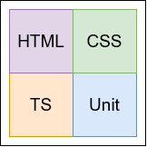
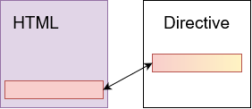
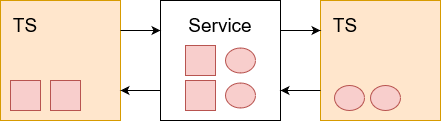
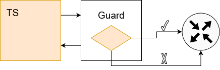
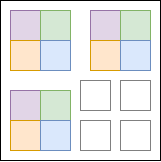

* ``ng new`` erzeugt ein neues Angular-Projekt
* ``ng generate`` erzeugt Komponenten, Services, uvm.
* ``ng serve`` baut ein Grundgerüst der Applikation
* ``ng lint`` kontrolliert den Code auf die Einhaltung vorgegebener Code Konventionen

| Typ       | Befehl                    |
|-----------|---------------------------|
| Component | ``ng g component <name>`` |
| Directive | ``ng g directive <name>`` |
| Pipe      | ``ng g pipe <name>``      |
| Service   | ``ng g service <name>``   |
| Class     | ``ng g class <name>``     |
| Guard     | ``ng g guard <name>``     |
| Interface | ``ng g interface <name>`` |
| Enum      | ``ng g enum <name>``      |
| Module    | ``ng g module <name>``    |

Die Namen der erstellten Dateien: < name>.< typ>.< dateiendung>  
Zum Beispiel: ``ng g service data`` generiert ``data.service.ts``


### Komponente ###

Eine neue Komponente kann im Terminal erstellt werden.  
Sie wird für gewöhnlich automatisch im Hauptmodul app.module.ts unter declarations eingebunden.



``ng generate component <component-name>``  abgekürzt: ``ng g c <component-name>``

Angular CLI erstellt dann automatisch vier Dateien im Projekt:
* __Ein HTML Template__, welche die Struktur der Seite definiert.
* __Eine TypeScript Klasse__, die das Verhalten der Seite beschreibt.
* __Eine CSS Datei__, welche für das Layout zuständig ist.
* __Ein Unit-Test__, mit dem die Anwendung getestet werden kann.

Es ist auch möglich manuell eine neue Komponente zu erstellen.
Das Grundgerüst einer Komponente ist so aufgebaut:

````
import { Component } from '@angular/core';

@Component({
  selector: 'app-component-overview',
  templateUrl: './component-overview.component.html',
  styleUrls: ['./component-overview.component.css']
})

export class ComponentOverviewComponent {
  constructor() { }
}
````

Im Decorator @Component wird die Klasse um Metadaten erweitert.
Hier wird die Klasse als Angular-Komponente definiert und beschrieben.


* __selector:__ CSS-Selektor zum Einfügen einer Instanz dieser Komponente in andere HTML-Templates
* __templateUrl:__ Pfad zur HTML-Vorlage der Komponente
* __styleUrls:__ Pfade zu einem oder zu mehreren CSS-Stylesheets
* __providers:__ Liste von Services, die mittels Dependency Injection bereitgestellt werden


### Directive ###
Direktiven sind Klassen, die den Elementen im Template neues Verhalten hinzufügen oder das vorhandene Verhalten ändern.
Grundsätzlich werden Direktiven verwendet, um das DOM zu manipulieren, 
zum Beispiel das Element hinzuzufügen/zu entfernen oder das Erscheinungsbild der DOM-Elemente zu ändern.  
_NgClass_ und _NgStyle_ sind beispielsweise Direktiven, es ist aber auch möglich eigene zu erstellen.



- __Attributs Direktiven__ Verändert das Verhalten eines Elements, Komponente oder anderer Direktive
- __Struktur Direktiven__ Verändert das DOM Layout, indem es Elemente hinzufügt oder entfernt


### Pipes ###  

Mit Pipes kann ein String, ein Datum oder andere Daten in der Anzeige transformiert werden.
Es sind einfache Funktionen in einem Template Ausdruck. 
Die Pipe bekommt einen Wert und gibt den überarbeiten Wert zurück. Sie können in der gesamten Anwendung benutzt werden.  


``{{ person.birthDate | date: ‘M/dd/Y’ }}``  Eine Pipe erkennt man an dem | Strich

Schon existierende Pipes können Datums formatieren, Buchstaben können groß oder kleingeschrieben werden.
Nummern werden in Strings verwandelt oder Objekte in ein lesbares JSON-Format. Hier eine Liste aller Pipes:
https://angular.io/api/common#pipes

Es ist auch möglich seine eigenen Pipes zu erstellen. So sähe das Grundgerüst aus (welches noch nichts formatieren kann).
Mit dem Namen der Pipe kann sie im Template benutzt werden ``{{ valueXY | custom }}``

````
import { Pipe, PipeTransform } from '@angular/core';

@Pipe({
 name: 'custom'
})

export class CustomPipe implements PipeTransform {   
    transform(value: any, args?: any): any {
     return null;
   }
}
````


### Service ### 

Services können Informationen zwischen verschiedenen Klassen austauschen, ohne das die Klassen sich kennen.
Sie eignen sich gut für Aufgaben wie das Abrufen von Daten auf einem Server oder das Überprüfen von Benutzereingaben.
Die Funktionen können von jeder Komponente verwendet werden, welcher den Service als _Dependency Injection_
in seinem Constructor eingebunden hat. Ein Service ist immer ein Singleton-Objekt.



````
import { Injectable } from '@angular/core';

@Injectable({
  providedIn: 'root'
})

export class MyDataService {
  constructor() { }
}
````

Hier lautet der Decorator _@Injectable_. Damit wird die Klasse gekennzeichnet, 
dass sie am _Dependency Injection System_ teilnimmt. Die Klasse ist der Anbieter des Service.
Sie stellt einen injizierbaren Dienst bereit und kann auch eigene injizierte Abhängigkeiten haben.

Im Injektor-Objekt wird der Service registriert. Er sucht, den passenden Anbieter, 
injiziert den Service und stellt es der Anwendung zur verfügung. 
Für gewöhnlich wird der Anbieter im 'root'-Injektor registriert mit der Eigenschaft _providedIn_.
Ist der Service in der Root-Ebene, erstellt Angular eine einzelne gemeinsam genutzte Instanz,
auf die jede Klasse, die danach fragt, zugreifen kann.

````
export class AppComponent {
  constructor(private service: MyDataService) {
      // Diese Einbindung des Services nennt sich Dependency Injection
  }
}
````


### Class ###

Eine Klasse ist genau das, eine ganz einfache schlichte Klasse

```
export class MyClass {
}
```


### Guard ###
Mit Guards ist es möglich, dass Benutzer nur unter einer bestimmten Bedingung Seiten aufrufen können.
Beispielsweise können sie eine Seite nicht besuchen oder sie nicht verlassen, 
wenn vorher ihre Daten nicht gespeichert wurden.

Angular Route Guards sind Schnittstellen, die von Angular bereitgestellt werden und die es uns ermöglichen, die Zugänglichkeit einer Route basierend auf der in der Klassenimplementierung dieser Schnittstelle bereitgestellten Bedingung zu steuern.



Fünf Arten von Route Guards werden von Angular bereitgestellt:
* CanActivate
* CanActivateChild
* CanLoad
* CanDeactivate
* Resolve

```
$ ng g guard MyGuard  
? Which interfaces would you like to implement? (Press < space > to select, < a > to toggle all, < i > to invert selection, and < enter > to proceed)  
❯◉ CanActivate  
◯ CanActivateChild  
◯ CanDeactivate  
◯ CanLoad 
``` 

__CanActivate__  
Mit diesem Interface kann eine Route verhindert werden, 
oder der Benutzer wird auf eine andere Route umgeleitet.
In dem Guard wird folgende Methode erstellt:

```
  canActivate(
    route: ActivatedRouteSnapshot,
    state: RouterStateSnapshot): Observable<boolean | UrlTree> | Promise<boolean | UrlTree> | boolean | UrlTree {
    return true;
  }
```
Und so wird es implementiert:
```
{path:'p/:id', component: HomeComponent, canActivate:[MyGuard]}
```

__CanActivateChild__  
Während _CanActivate_ die Zugänglichkeit der aktuellen Route steuert, 
wird dieser Guard verwendet, um den Zugriff auf eine untergeordnete Route zu verhindern.

__CanLoad__  
Module in Angular können alle auf einmal heruntergeladen werden, oder nur bei Bedarf (Lazy Loading)
Wenn eine Seite mit _CanActivate_ verhindert wird, so wird sie dennoch geladen.
Um das Herunterladen des Modules zu verhindern, wird _CanLoad_ verwendet. 
Der Vorteil, die Anwendung wird schneller geladen.

Die Implementierung ist genau wie beim _CanActive_, zuerst den Guard definieren und dann
der Routendefinition übergeben.

__CanDeactivate__  
Mit diesem Guard kann verhindert werden, dass der Benutzer sie Route verlässt.
Die Methode sieht etwas anders aus:
```
  canDeactivate(
    component: unknown,
    currentRoute: ActivatedRouteSnapshot,
    currentState: RouterStateSnapshot,
    nextState?: RouterStateSnapshot): Observable<boolean | UrlTree> | Promise<boolean | UrlTree> | boolean | UrlTree {
    return true;
  }
```
Um es zu implementieren wird außer dem Guard ein CanDeactivate Interface benötigt.
Das kann in die gleiche Datei wie der Guard geschrieben werden.

```
export interface CanComponentDeactivate {
    canDeactivate: () => Observable<boolean> | Promise<boolean> | boolean;
}
```
Dieses Interface wird in die gewünschte Komponente implementiert.
Die Methode in der Komponente gibt dann true oder false zurück.
Dann muss der Guard nur noch in der Routendefinition übergeben werden.

Eine schöne Anleitung zu Guards findet man <a href="https://codeburst.io/understanding-angular-guards-347b452e1892">hier</a>


### Interface ###

Ein Interface ist genau das, ein ganz einfaches schlichtes Interface

```
export interface MyInterface {
}
```

*

### Enum ###

Bei einem Enum wird ein leeres Enum-Objekt erstellt, das beliebig gefüllt werden kann.

```
export enum MyEnum {
}
```


### Module ###

Ein Modul ist ein Mechanismus zum Gruppieren von Komponenten, Direktiven, 
Pipes und Diensten, die verwandt sind, so dass sie mit anderen Modulen kombiniert werden können, 
um eine Anwendung zu erstellen.



Wird ein Modul erstellt, so legt Angular einen neuen Ordner mit dem Namen des Modules an
und erstellt dort eine neue module.ts
```
@NgModule({
  declarations: [],
  imports: [
    CommonModule
  ]
})
export class MyModulModule { }
```
In den Optionen des Moduls werden die zugehörigen Komponenten, Direktiven und Pipes aufgelistet.
Es kann diese für andere Module öffentlich machen oder selber Module mit ihren Komponenten, Direktiven und Pipes
importieren und verwenden. Zudem stellt es auch die benötigten Dienste bereit.  
