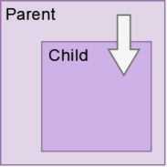
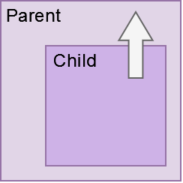
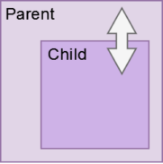
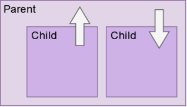
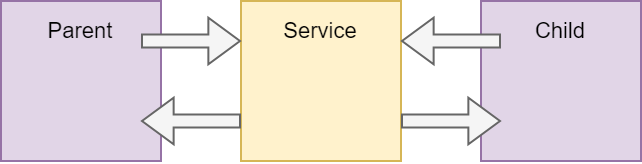

## Communication ##

Die Kommunikation zwischen Komponenten kann auf verschiedenen Weisenden stattfinden.
Möchten nur Eltern- und Kindkomponenten Daten tauschen, so kann Data Binding ausreichen.
Wenn mehrere Komponenten die Informationen haben wollen, sollte ein Service verwendet werden.
Werden die Informationen asynchron gebraucht, ist eine Bibliothek wie RxJS notwendig. 

### Eltern zum Kind ###


#### Input Binding ####
In diesem Beispiel hat die Eltern-Komponente die 
Eigenschaft _parentVar_. Wenn die Kind-Komponente im Template aufgerufen wird
kann die Variable _parentVar_ mitgegeben werden. In den [ ] steht der Name der
Input-Eigenschaft des Kindes, hinter den = der zu übergebene Wert.

```
export class ParentSayComponent{
  parentVar: string = "Ich bin dein Vater!";
}
```
```
<app-child-one-say [fromParent]="parentVar"></app-child-one-say>
```
Die Input-Eigenschaft des Kindes heißt in diesem Beispiel _fromParent_.
Mit dem Decorator _@Input()_ wird sie als solche markiert. Nun ist der Wert
dieser Variable der gleiche den _parentVar_ bei der Geburt des Kindes hatte.
Im Template kann die Eigenschaft wie jede andere normale Eigenschaft aufgerufen werden.
```
export class ChildOneSayComponent{
  @Input() fromParent: string = '';
}
```
```
Kind hörte: {{fromParent}}
```


#### Input mit Parameter ####

Dem _@Input()_ kann ein String als Argument übergeben werden. 
Dieser ist ein Alias welche beim Initialisieren der Kind-Komponente verwendet werden kann.
Statt dem Namen der Eigenschaft _fromParent_ wird hier _hallo_ verwendet. 
Der Name der Variable verändert sich nicht. Die Kind-Komponente ruft sie noch immer
mit _fromParent_ auf.

```
<app-child-one-say [hello]="parentVar"></app-child-one-say>
```
```
export class ChildOneSayComponent{
  @Input('hello') fromParent: string = '';
}
```


#### Input abfangen mit Setter ####
Werte von der Eltern-Komponente können abgefangen werden, um darauf zu reagieren.
So kann ein String formatiert werden oder bei leeren Werten ein Defaultwert gesetzt werden.

```
export class ChildOneSayComponent{
  @Input()
  
    get fromParent(): string
      { return this._fromParent; }
      
    set fromParent(text: string)
      { this._fromParent = text || "Leer!"}
      
  _fromParent: string = '';
}
```


### Kind zu Eltern ###


#### Output Binding ####
Das _@Output_ ist das Gegenstück zum _@Input_, mit ihm lassen sich Informationen vom Kind
zum Elternteil tragen. Es benutzt dafür ein _EventEmitter_ einen Observer welcher
Änderungen registriert und diese an alle schickt die ihm zuhören.

Für dieses Beispiel soll in dem Kind-Template eine Input-Eingabe ausgewertet werden,
und das Ergebnis, ob true oder false, dem Elternteil mitgeteilt werden. 
Dieser soll dann in seinem Template das Ergebnis zeigen bzw darauf reagieren. 
Dafür bekommt das Kind die Output-Variable _childStatus_, dieser ist immer ein
EventEmitter (Observer).  
Die zweite Variable _childSay_ hält den Wert, der zum Elternteil übermittelt werden soll.
Der Defaultwert ist hier false. (Darum hat der EventEmitter den Variablentyp `<boolean>`)

```
  @Output() childStatus = new EventEmitter<boolean>();
  childSay: boolean = false;
```
Der Wert von _childSay_ ändert sich, 
je nachdem was in dem Input-Feld der Kind-Komponente eingetragen wird.
Bei jeder Änderung im Feld wird ein Event ausgelöst, das eine Funktion in der
Kind-Komponente startet und den Value vom Input-Feld mit gibt. 

```
Was ergibt 5 + 3 = <input type="number" #result (change)="answer(result.value)">
```
In der Funktion _answer()_ wird der übergebene Value verarbeitet. 
Je nach Ergebnis wird die Variable _childSay_ aktualisiert, auf den Wert true oder false.
Dann wird der Wert von _childSay_ dem EventEmitter mit der Methode `.emit` übergeben.
Somit wird das Event ausgelöst, was die Eltern-Komponente benachrichtigt.
```
  answer(input: string){
    const result = parseInt(input);

    (result === 8)? this.childSay = true : this.childSay = false;
    this.childStatus.emit(this.childSay);
  }
```
Beim Initialisieren des Kindes wurde, per Event-Binding, der EventEmitter mit dem
Namen _childStatus_ gebunden. Wird dieser vom Kind ausgelöst, wird der Wert des
EventEmitters an die Funktion _changeStatus($event)_ übergeben. 
Diese ist eine Methode der Eltern-Komponente und weist den übergebenen Wert 
einer Membervariable zu. 
```
<app-child-one-say (childStatus)="changeStatus($event)"></app-child-one-say><br>
```
```
  parentStatus: boolean = false;

  changeStatus(status: boolean){
    this.parentStatus = status;
  }
```


#### Zugriff mit Template Variablen ####
Eltern-Komponenten können Data Binding nicht nutzen um auf Eigenschaften und Methoden des
Kindes zuzugreifen. Wenn die Kind-Komponente im Template des Elternteiles eine Template 
Variable bekommt, ist es mit dieser Variable, als Referenz dann doch möglich.

```
<app-child-one-say #child></app-child-one-say>

Eltern hören: {{child.childVar}}<br>
Eltern hören: {{child.childFunction()}}
```


#### ViewChild ####
Wenn die Eltern-Komponente nicht nur in seinem Template auf die Eigenschaften
und Methoden des Kindes zugreifen möchte, gibt es den Decorator _@ViewChild_.
Dieser wird in der Eltern-Komponente erstellt und hat als Übergabewert den Namen
der Kind-Komponente. Das erste Vorkommen dieser Komponente wird in die Variable
_child_ gespeichert. Diesmal nicht mit dem = Zeichen, denn zu Beginn der 
Eltern-Komponente gibt es das Kind nicht. Das "!" gibt an, das die Initialisierung
später erfolgt.
```
@ViewChild(ChildOneSayComponent)
  private child!: ChildOneSayComponent;
  
  childSay: string = "Nichts";

showVar(){this.childSay = this.child.childVar}
showFun(){this.childSay = this.child.childFunction()}
```
Im Template der Eltern können Eigenschaften und Methoden des Kindes nicht direkt
aufgerufen werden, sie gibt es zu dem Zeitpunkt noch nicht. Mit einem Lifecycle Hook
_AfterViewInit_ lassen sich Methoden beim Initialisieren des Kindes direkt ausführen.
Es ist ein Interface das eine bestimmte Funktion erfordert: _ngAfterViewInit()_.
In dieser steht der Code, welcher ausgeführt werden soll.

```
export class ParentSayComponent implements AfterViewInit{

  @ViewChild(ChildOneSayComponent)
    private child!: ChildOneSayComponent;

  ngAfterViewInit() {
    this.child.childAlert();
  }
}  
```

Wenn von der Kind-Komponente mehrere existieren können alle mit _@ViewChildren_ 
in eine View QueryList aufgelistet werden. 


#### ViewChild mit Template Variablen ###
Der Übergabewert von _ViewChild_ muss nicht der Name der Kind-Komponente sein.
Wenn der Kind-Komponente eine Template Variable gegeben wurde, kann
diese als Übergabewert mit gegeben werden. Dieser Alias wird in ' ' geschrieben.
Auf diese Weise können auch DOM-Elemente mit ViewChild beeinflusst werden,
nur das der Variablentyp dann keine Komponente ist, sondern _ElementRef_
```
<app-child-one-say #childCom></app-child-one-say>
```
```
  @ViewChild('childCom')
    private child!: ChildOneSayComponent;
```


### Tow-way ###


#### Kombination von In- und Output ####

Mit dem Two-way Binding können Informationen von Eltern und Kind in beide Richtungen fließen.
Es ist eine Kombination von Eigenschaft `[ ]` und Event `( )` Binding. 
Die Syntax ist `[( )]` was auch "Banana in the box" genannt wird.
```
<app-child-one-say [(childNumber)]="parentNumber"></app-child-one-say>
```
In diesem Beispiel haben Eltern und Kind eine Membervariable die synchron gehalten werden soll.
Wird im Kind diese Variable verändert, soll auch der Wert der Eltern-Variable verändert werden.
`[(childNumber)]` ist die Eigenschaft des Kindes, `"parentNumber"` die der Eltern.

In der Kind-Komponente gibt es einen _@Input_ und den passenden _@Output_. Dabei ist die Vergabe der Namen wichtig.
Die Output-Variable muss den Namen der Input-Variable tragen, plus einem an gehangenen "Change".
- @Input Name = eigenschaft
- @Output Name = eigenschaftChange
```
  @Input() childNumber!: number;
  @Output() childNumberChange = new EventEmitter<number>()

  increase(){
    this.childNumber++;
    this.childNumberChange.emit(this.childNumber);
  }
  decrease(){
    this.childNumber--;
    this.childNumberChange.emit(this.childNumber);
  }
```
Die Ausgabe im Template der Eltern `Nummer der Eltern: {{parentNumber}}` ist dieselbe 
die Ausgabe wie im Template des Kindes `Nummer vom Kind: {{childNumber}}`


#### Two-way in Formularen [(ngModule)] ####
In Formularen ist das name-pattern mit x und xChange nicht möglich. Dafür gibt es `ngModule` 
Das lässt sich in der gleichen Komponente einbauen. Eine Eingabe in ein Input-Feld mit `[(ngModule)]`
verändert die Membervariable und kann sie synchron im Template aktualisieren.
```
<input type="text" [(ngModel)]="username"><br>

Dein Name ist: {{username}}
```
Das macht das Gleiche wie: `<input [value]="username" (input)="username = $event.target.value">`

ngModule erstellt eine Instanz von `FormControll` welches zu einer Gruppe von Direktiven gehört,
die sich mit Formularen beschäftigen (FormModule). FormControll hält den Wert des Formulas, den Validierungsstatus
und sorgt dafür das die Daten im Model synchron zum Template bleiben. Es hat eine Reihe von Eigenschaften
und Methoden, auf die mithilfe einer Template-Variable zugegriffen werden kann: `#ctrl="ngModel"`

Sollen die Werte noch verarbeitet werden, kann das [(ngModule)] in seine einzelnen Bindings zerlegt werden.
So könnte zum Beispiel die Eingabe durch eine Funktion formatiert werden.
```
<input type="text" [ngModel]="username" (ngModelChange)="upperString($event)">
```


### Unter Geschwistern ###


Geschwister-Komponenten sollten zum austausch von Informationen einen Service benutzen.
Mit der Kombination von _Input_ und _Output_ ist eine einfache Kommunikation,
über das Elternteil möglich. Dabei gibt das Erste Kind per Output einen Wert
an das Elternteil, während das zweite Kind per Input den Wert wieder abgreift.

```
<app-child-one-say (messageChildOne)="parentMessage=($event)"></app-child-one-say><br>

<app-child-two-say [messageChildTwo]="parentMessage"></app-child-two-say>
```


### Mit Service ###


Ein Service bietet Dienste an, die von mehreren Komponenten verwendet werden. 
Das kann eine Verbindung zu einer API sein, oder ein Datenmodel mit Gettern und Settern.
Damit Komponente sie verwenden können, werden diese Services per _Dependency Injection_
eingebunden. Das heißt, sie werden im Constructor als private Variable angelegt.

```
  constructor(private service: ShareService) { }
```
Jede Komponente, welche den Service injiziert hat, kann auf seine Methoden zugreifen.
Allerdings werden die Informationen nicht automatisch aktualisiert, wenn sich etwas ändert.
Dafür werden Observer benötigt.
```
Komponente 1                            | Komponente 2
                                        |
this.data = this.service.getData();     | this.service.setData(this.data);
```


