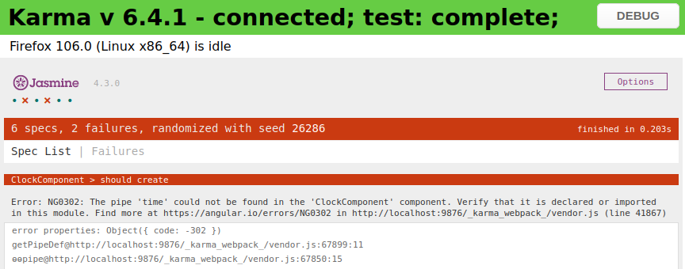
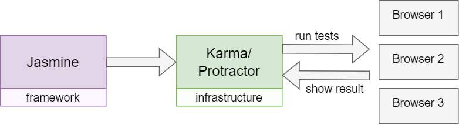

## Angular Testing ##

Angular bringt Werkzeuge zum Testen der Anwendung mit. Dabei gibt es zwei Typen von Tests.

__Unit-Tests__  
Zum testen von einzelnen Methoden und Codestücken. Das wäre zum Beispiel die Frage
ob Observable und Services die richtigen Werte zurückgeben,
oder ob die korrekte Exception geworfen wird.
Diese Tests werden während der Entwicklung häufig gemacht, sollten daher wenig Laufzeit haben.

__End-zo-End-Tests (E2E)__  
Zum Testen größerer Einheiten bis hin zur grafischen Oberfläche.
Es werden zum Beispiel Benutzerinteraktionen und Workflows getestet.
Sowas wie eine Tastatureingabe, oder ein Klick auf einem Button.
Diese Tests laufen nicht so häufig wie Unit-Test und brauchen länger,
da sie das ganze System betreffen.


### Installation der Testing-Tools ###

Wird eine Angularanwendung mit CLI erstellt, werden sämtliche benötigten Pakete heruntergeladen.
Zu den Kernkomponenten ebenfalls Tools zum Testen: Jasmine und Karma + Protractor und Webdriver-manager.
Sie können auch manuell per Terminal dem Projekt hinzugefügt werden.

```
| Jasmine        |                                                 

| Installieren   | `npm install --save-dev jasmine`                
| Initialisieren | `npx jasmine init`                              
| Plugins        | `npm install karma-firefox-launcher --save-dev` 
| Tests starten  | `npm test`                                      
```
 
```
| Karma          |                                                                           

| Installieren   | `npm install karma --save-dev`                                            
| Plugins        | `npm install karma-jasmine karma-chrome-launcher jasmine-core --save-dev` 
| Karma starten  | `./node_modules/karma/bin/karma start`                                    
```

```
| Protractor     |                             

| Installieren   | `npm install -g protractor` 
| Update         | `webdriver-manager update`  
| Server starten | `webdriver-manager start`   
| Tests starten  | `npm run e2e`
```


### Jasmine, Karma und Protractor ###

#### Jasmine ####  
Es ist ein unabhängiges Framework zum Testen von Verhalten (Behavior-Driven Development) im JavaScript-Code. 
Dabei funktioniert es mit Node.js oder im Browser. Der Focus liegt bei einer klaren und verständlichen
Syntax.


Sobald im Terminal `npm test` eingegeben wurde, öffnet sich im Browser ein Fenster.
Es zeigt das Ergebnis der Unit-Tests an. Diese stehen auch im Terminal, im Browser
ist es leichter zu lesen.


#### Karma ####
Karma hat die Aufgabe einen Server zu simulieren, damit TypeScript ausgeführt werden kann.
Es dient aber nur dazu die Unit-Tests zum Laufen zu bringen (Test-Runner).
In der Konfigurationsdatei _karma.conf.js_ wird unter anderen festgelegt,
welche Dateien für die Ausführung eines Tests geladen sein müssen, 
welche Laufzeitumgebung verwendet werden soll und auf Basis welches 
Testing-Frameworks die einzelnen Tests entwickelt werden sollen.

```
config.set({
    basePath: '',
    frameworks: ['jasmine', '@angular-devkit/build-angular'],
    plugins: [
      require('karma-jasmine'),
      require('karma-firefox-launcher'),
      require('karma-jasmine-html-reporter'),
      require('karma-coverage'),
      require('@angular-devkit/build-angular/plugins/karma')
    ],
    client: ...
```

Der Browser ist default auf Chrome eingestellt. Mit einem Plugin kann dieser
zum Beispiel auf Firefox umgestellt werden. Es gibt einige Plugins, hier eine Seite dazu:
<a href="https://www.npmjs.com/search?q=keywords:karma-plugin"> Plugins</a>


#### Protractor ####



Offizielle Seite von Jasmine: https://jasmine.github.io/pages/docs_home.html  
Offizielle Seite von Karma: https://karma-runner.github.io/latest/index.html  
Offizielle Seite von Protractor: https://www.protractortest.org/#/  


### Unit Tests

Mit Jasmine lassen sich einzelne Funktionen testen, Unit Tests. Dabei soll das Verhalten der Funktion getestet werden. Ziel ist es nicht Tests zu schreiben, die "grün" ergeben, sondern problematische Fälle zu überprüfen.  
Eine Funktion die zwei Zahlen addieren soll, wird vermutlich mit `add(4,3)` keine Probleme haben. Was aber, wenn ein negativer Wert heraus kommt? `add(4, -6)`?
Wird die Funktion im positiven Bereich bleiben, also `0` zurück geben, oder wird sie einen negativen Wert `-2` zurück geben. Das könnte für die Verwendung des Ergebnisses wichtig sein und sollte getestet werden.

__Beim Test sind die Funktionen Blackboxen, was drin steckt ist unbekannt__

Die wichtigsten Funktionen von Jasmine sind:  
- `describe()` Eine Sammlung einzelner Tests, auch "test suite" genannt  
- `beforeAll()` Wird einmal vor allen Tests ausgeführt  
- `beforeEach()` Wird vor jedem Test ausgeführt  
- `it()` Der einzelne Test  
- `expect()` Erwartung zusammen mit einem Matcher
- `afterEach()` Wird nach jedem Test ausgeführt  
- `afterAll()` Wird einmal nach allen Tests ausgeführt

Beispiel einer Testdatei:
```
describe('MenuIconComponent', () => {

  beforeEach(() => {
    TestBed.configureTestingModule({
      imports: [MenuIconComponent],
    }).overrideComponent(MenuIconComponent, {
      set: { imports: [], schemas: [NO_ERRORS_SCHEMA] },
    });

    fixture = TestBed.createComponent(MenuIconComponent);
    component = fixture.componentInstance;
    fixture.detectChanges();
  });

  it('should create', () => {
    expect(component).toBeTruthy();
  });
});

```


#### AAA-Tests Patterns ####

__Arrange__ Etwas vorbereiten __Act__  Aktion durchführen __Assert__ Ergebnisse bestätigen.  
Die Vorbereitung findet im `beforeEach()` statt, 
der Act ist meist im `it()` zu finden,
Assert wird im `expert()` gefragt. Das ist nicht zwingend so, die Aktion
kann auch im beforeEach statt finden und nur für das Ergebnis wird eine oder mehrere Spezifikation geschrieben


#### expert() ####
Die Funktion `expert()` wird immer mit einem _Matcher_ zusammen benutzt. 
Dieser kann mit .not verneint werden. Es gibt viele, hier die wichtigsten:

`expert(var1).toBe(var2)` Der Wert var1 ist genau der Wert var2  
`expert(var1).not.toBe(var2)` Der Wert var1 ist nicht der Wert var2

| Matcher            | Beschreibung                                  |
|--------------------|-----------------------------------------------|
| toBe(5)            | Der Wert ist genau (===)                      |
| toEqual(object)    | Der Wert ist inhaltlich gleich                |
| toContain('Hallo') | Der Wert enthält den String                   |
| toBeTruthy()       | Der Wert ist war                              |
| toBeFalsy()        | Der Wert ist falsch                           |
| toBeNull()         | Der Wert ist null                             |
| toBeUndefined()    | Der Wert ist undefined                        |
| toMatch(`\w+`)     | Der Wert trifft auf den regulären Ausdruck zu |


#### Non-Null ####
Soll eine Methode auch `null` zurück geben können/sollen würde der 
TypeScript-Compiler meckern: _Object is possibly null_ Mit dem Non-Null
Assertion Operators (ein Ausrufezeichen) kann an dieser Stelle der Null-Check deaktiviert werden.

```
const result = validator.validate(control);
expect(result!['invalidEMail']).toBeTruthy();
```


#### Gezielt Tests ausführen oder ausschließen ####

Mit `xdescripe` und `xit` können Test-Suites und Tests übersprungen werden.  
Mit `fdescripe` und `fit` werden nur diese Test-Suites und Tests ausgeführt


### Isolierte Unit-Tests

Zusätzlich zu den Funktion von Jasmine bietet Angular noch weitere Methoden und Klassen an. Hilfsmittel wie `TestBed`, `waitForAsync` oder `fakeAsync`  
Ein Problem beim testen sind die Abhängigkeiten der Komponenten, wie Services, Direktiven oder Klassen. Diese Abhängigkeiten müssen ersetzt werden um wirklich _nur_ die Komponente zu testen und Fehler innerhalb dieser zu finden. Können nicht alle Abhängigkeiten ersetzt werden, handelt es sich um einem Integrationstest. Im einfachsten Fall werden die "unechten" Abhängigkeiten direkt im Code instanziiert. Diese Tests nennen sich _isolierte Tests_ Sie brauchen die Hilfsmittel von Angular nicht. 

```
import { BookStoreService } from './book-store.service';

describe('BookStoreService', () => {
  let service: BookStoreService;
  beforeEach(() => {
    service = new BookStoreService();
  });

  it('should hold a hardcoded list of 2 books', () => {
    const books = service.getAll();
    expect(books).toHaveSize(2);
  });
});
```

#### Schemas ####

Angular prüft ob alle verwendeten Elemente im Template bekannt sind und ob die benötigten Kindkomponenten deklariert sind. Wenn nicht gibt es eine Fehlermeldung `ERROR:'NG0304'` Ist das Element für den Test nicht notwendig kann dieser Fehler mit einer Einstellung im TestBed ignoriert werden. Dafür wird das Schema `CUSTOM_ELEMENTS_SCHEMA` dem Modul hinzugefügt. 

Hat die Kindkomponente Eigenschaften die per Binding gesetzt werden, gibt es einen weiteren Fehler `ERROR:'NG0303'` Mit dem Schema ` NO_ERRORS_SCHEMA` werden Fehler im Template mit Elementen oder Eigenschaften ignoriert.

```
TestBed.configureTestingModule({
  declarations: [MyComponent],
  schemas: [NO_ERRORS_SCHEMA] 
})

```
So wird ausschließlich die Elternkomponente gerendert. Das nennt sich Shallow Component Test.
Dieser Test zeichnet sich dadurch aus, dass zwar eine
Testumgebung geschaffen wird, aber weiterhin nur eine einzelne Komponente getestet wird.


### Integrierte Unit-Tests (TestBed) ####
Wird zum testen Angular benötigt, weil zum Beispiel das View gebraucht wird, kommt `TestBed` zum einsatz.  Mit TestBed kann eine Angular-Umgebung emuliert werden. Diese kann nach Bedarf konfiguriert werden. 

```
let component: MyComponent;
let fixture: ComponentFixture<MyComponent>;

beforeEach(() => {
  TestBed.configureTestingModule({
    declarations: [ MyComponent ],
  });
  
  fixture = TestBed.createComponent(MyComponent);
  component = fixture.componentInstance; 
});
```


#### Change Detection ###

Das `TestBed.createComponent()` triggert nicht die change detection. Es führt also keine Data Binding durch, das muss manuell mit `fixture.detectChanges();` gemacht werden.

```
it('should display a different test title', () => {
  let h1 = fixture.nativeElement.querySelector('h1');
  component.title = 'Test Title';
  fixture.detectChanges();
  
  expect(h1.textContent).toContain('Test Title');
});
```

Es ist auch möglich die Change Detection automatisch laufen zu lassen.
Dafür muss es im TestBed konfiguriert und ` ComponentFixtureAutoDetect` importiert werden.

```
TestBed.configureTestingModule({
  declarations: [ MyComponent ],
  providers: [
    { provide: ComponentFixtureAutoDetect, useValue: true }
  ]
});
```


#### Benutzer Aktionen Simulieren ####

Um Benutzereingaben oder Events zu simulieren wird der Wert des Values vom Element gesetzt. Bevor die Change Detection getriggert wird muss das Event manuell ausgelöst werden. Das geht mit `dispatchEvent()`

Erstes Beispiel, wenn ein Button geklickt wird
```
  it('should emit buttonClicked event on button click', () => {
    const spy = spyOn(component.buttonClicked, 'emit');
    const buttonElement: HTMLButtonElement = fixture.nativeElement.querySelector('button');
    
    buttonElement.dispatchEvent(new Event('click'));
    
    expect(spy).toHaveBeenCalled();
  });
```

Zweites Beispiel, wenn ein name eingegeben wird
```
  it('should update enteredName when input changes', () => {
    const inputElement: HTMLInputElement = fixture.nativeElement.querySelector('input');
    inputElement.value = 'John';
    
    inputElement.dispatchEvent(new Event('input'));
    fixture.detectChanges();

    expect(component.enteredName).toEqual('John');
  });
```


### Mocks und Spies ###

In der Welt der Unit-Tests existieren unterschiedliche Arten von Testduplikaten
(ersetzte Abhängigkeiten).

Ein __Stub__ ist ein kontrollierbarer Ersatz für eine Abhängigkeit. Er zeichnet sich durch vordefinierte Eigenschaften bzw. vordefinierte Rückgabewerte bei Methoden aus.
Mit Stubs kann der __Endzustand__ im Vergleich zum Anfangszustand
des Systems Under Test (SUT) verifiziert werden.

Ein __Mock__ ist ebenso ein kontrollierbarer Ersatz für eine Abhängigkeit. Er
zeichnet sich genau wie der Stub durch vordefinierte Eigenschaften bzw.
vordefinierte Rückgabewerte bei Methoden aus. Zusätzlich können die
Erwartungen (expect()) gegen den Mock ausgeführt werden. Dies kann z. B. eine
Prüfung sein, wie oft eine Methode aufgerufen wurde.
Mit Mocks wird das __Verhalten__ der SUT verifiziert.


#### Eigenen Stub erstellen ####

```
describe('BookStoreService', () => {
  let service: BookStoreService;
  
  beforeEach(() => {
    const expectedBooks: Book[] = [
      { isbn: '111', title: 'Book 1', authors: [] },
      { isbn: '222', title: 'Book 2', authors: [] }
    ];
    
    const httpStub = {
      get: () => of(expectedBooks)
    };

    TestBed.configureTestingModule({
      providers: [
        { provide: HttpClient, useValue: httpStub }
      ]
    });

    service = TestBed.inject(BookStoreService);
  });

  it('should GET a list of all books', () => {
    let receivedBooks!: Book[];
    service.getAll().subscribe(b => receivedBooks = b);

    expect(receivedBooks).toHaveSize(2);
    expect(receivedBooks[0].isbn).toBe('111');
    expect(receivedBooks[1].isbn).toBe('222');
  });
});
```
Der Stub in diesem Beispiel ist das Objekt `httpStup` mit nur einer Mehrode, die ein Observable zurück gibt.
Parameter, wie es beim HttpClient üblich ist, braucht der Test nicht.
Im TestBed wird der HttpClient bereitgestellt, aber dessen Value mit dem 
selbst erstellten Stub ersetzt.  

```
  const httpStub = {
    get: () => of(expectedBooks)
  };

  ...

  TestBed.configureTestingModule({
    providers: [
      { provide: HttpClient, useValue: httpStub }
    ]
  });
```

Testduplikate müssen nicht vollständig sein. Wichtig ist nur das eine Methode mit dem richtigen Namen benutzt wird und dieser den passenden Rückgabewert besitzt.


#### Abhängigkeiten Injizieren ####

Bei der Dependency Injection wird die Abhängigkeit in dem Kunstruktor geschrieben.
Bei Tests funktioniert das mit `TestBed.inject()` Wird sie nur in einer Spezifikation benutzt,
kann es direkt vor Ort eingebunden werden. Wird es öfter benutzt, ist es sinnvoll diese im `beforeEach()` in einer Variable zu speichern. Die Abhängigkeit steht sofort ohne Vorbereitung zur Verfügung.

```
let userServiceStub: Partial<UserService>;

  userServiceStub = {
    isLoggedIn: true,
    user: { name: 'Test User' },
  };
```

In TypeScript ist `Partial<T>` ein vordefiniertes generisches Typ, das verwendet wird, um ein neues Typ-Objekt zu erstellen, bei dem alle Eigenschaften von T optional gemacht werden. Das bedeutet, dass jede Eigenschaft von T im neuen Typ `Partial<T>` entweder vorhanden sein kann oder nicht, ohne dass es zu einem Typenfehler kommt

```
TestBed.configureTestingModule({
   declarations: [ WelcomeComponent ],
   providers: [ { provide: UserService, useValue: userServiceStub } ],
});

userService = TestBed.inject(UserService);
```
 


#### Spione, Verhalten Testen ####

Bei Jasmine erzeugt man Mocks mittels sogenannter Spys (Spione). Damit wird ein Objekt überwacht, und sein verhalten kann von außen kontrolliert werden.

  - `spyOn(<xy>).and.callThrough()` Das ursprüngliche Verhalten soll beibehalten werden
  - `spyOn(<xy>).and.returnValue(<value>)` Ein vordefinierter Wert wird zurück gegeben
  - `spyOn(<xy>).and.returnValues(<value1>, <value2>, ...)` Eine Liste von Werten wird zurück gegeben
  - `spyOn(<xy>).and.callFake(<fakeFn>)` Eine eigene fake Funktion wird stattdessen ausgeführt
  - `spyOn(<xy>).and.throwError(<error>)` Es soll ein bestimmter Fehler geworfen werden 

Die Spione werden durch verschiedene Matchers abgefragt. Damit kann geprüft werden ob, wann und wie oft eine bestimmte Methode aufgerufen wurde.

| Matcher                    | Stellt sicher das ...                                                       |
|----------------------------|-----------------------------------------------------------------------------|
| toHaveBeenCalled()         | der Spion mindestens einmal aufgerufen wurde                                |
| toHaveBeenCalledBefore()   | der Spion vor einem anderen Spion aufgerufen wurde                          |
| toHaveBeenCalledOnceWith() | der Spion mit den angegebenen Argumenten genau einmal aufgerufen wurde      |
| toHaveBeenCalledTimes()    | der Spion genau die angegebene Anzahl von Aufrufen erhalten hat             |
| toHaveBeenCalledWith()     | der Spion mit den angegebenen Argumenten mindestens einmal aufgerufen wurde |
| toHaveSpyInteractions()    | mindestens ein Spion des Objektes mindestens einmal aufgerufen wurde        |

```
export class Calculator {
  add(a: number, b: number): number {
    return a + b;
  }
}
```
```
import { Calculator } from './calculator';

describe('Calculator', () => {
  it('should return the specified value', () => {
    const calculator = new Calculator();
    spyOn(calculator, 'add').and.returnValue(10);

    expect(calculator.add(5, 3)).toEqual(10); 
    expect(calculator.add).toHaveBeenCalledWith(5, 3);
  });
});

```


### Wie testet man ... ###


#### Formulare ####


#### Http-Requests ####


#### Routen ####


#### Asynchronen Code ####


