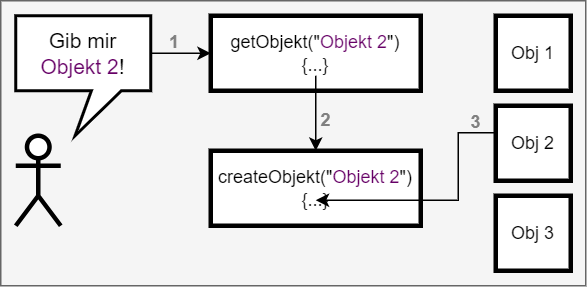
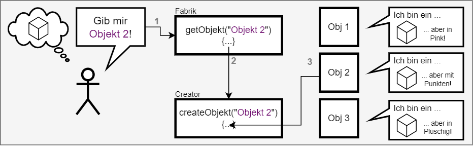

## Factory (Fabrik)



Nein, das ist kein UML-Diagramm, sondern ein Bild wie ich mir das Factory-Pattern bildhaft vorstelle. 

Das Factory-Pattern ist sehr nützlich, bei einer Klasse, die eine Reihe von Objekten erstellen muss, aber nicht weiss, welche Objekte sie erstellen soll, bis sie zur Laufzeit ausgeführt wird. Durch das entkoppeln der Objekte ist es sehr einfach neue Objekte hinzuzufügen. Sie müssen nur der createObjekt Funktion bekannt gemacht werden.
Sonst muss nichts im Code geändert werden.

### So funktioniert es

Ein Factory-Pattern besteht aus 3 Teilen:
1. Die Factory (Fabrik)
2. Der Creator (Erzeuger)
3. Die konkreten Produkte

Die Figur will das Objekt "Zwei" erstellen. Sie weiss aber nicht, wie sie das machen soll. Sie ruft die Factory an und sagt ihr, dass sie ein Objekt erstellen soll. Die Factory weiss, dass sie den Creator anrufen muss, um das Objekt zu erstellen. Der Creator erstellt das Objekt und gibt es an die Factory zurück. Die Factory gibt das Objekt an die Figur zurück. Dieses Objekt wird auch konkretes Produkt genannt.

Damit die Figur mit dem noch unbekannten Objekt arbeiten kann, muss es ein Interface oder eine abstrakte Klasse geben, die alle Objekte implementieren. Die Figur kann dann mit dem Objekt arbeiten, ohne zu wissen, was es ist.



### Die Factory (Fabrik)
```typescript	
function getObject(type){
    return createObject(type);
}
```	
Der Typ ist der Indentifier des Objekts. Es kann ein String, eine Zahl oder ein anderes Objekt sein. Die Factory ruft die createObject Funktion auf und übergibt den Typ. Die createObject Funktion erstellt das Objekt und gibt es an die Factory zurück.  
Es kann auch Situationen geben, wo kein Übergabewert notwendig ist, damit die Factory das Objekt erstellen kann. Zum Beispiel wenn abhängig von der Tageszeit ein Objekt erstellt werden soll. Die notwendigen Informationen kann die Fabrik selber sammeln.  

### Der Creator (Erzeuger)
```typescript
function createObject(type){
    switch(type){
        case 1:
            return obj1;
        case 2:
            return obj2;
        case 3:
            return obj3;
    }
}
```	
Der Creator erstellt das Objekt und gibt es an die Factory zurück. Der Creator kann auch eine Klasse sein, die das Objekt erstellt. In diesem Beispiel bekommt der Creator eine Zahl übergeben und erstellt das Objekt, das zu dieser Zahl gehört. 
Werden die Objekte oder Klassen in einer Liste gespeichert, kann der Creator auch die Liste durchsuchen und das passende Objekt zurückgeben. Dann sähe die Funktion so aus:

```typescript
function createObject(type){
    return objects[type];
}
```

### Die konkreten Produkte
Die Objekte können eigene Klassen oder wortwörtlich einfache Objekte sein.

```typescript
// Einfache Objekte, jeder hat einen anderen Inhalt
const obj1 = {
    text: "Eins",
    digit: 1,
}

const obj2 = {
    text: "Zwei",
    digit: 2,
}

const obj3 = {
    text: "Drei",
    digit: 3,
}
```
oder
```typescript
// Eine kompakte Liste aller Objekte,
// Statt der Objekte kann es auch eine Sammlung von Klassen sein 
const objects = {
    1: {text: "Eins", digit:1},
    2: {text: "Zwei", digit:2},
    3: {text: "Drei", digit:3},
}
```